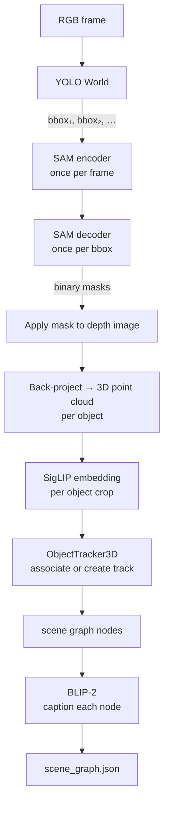

# Intro to Computer Vision

If machine learning is the brain, computer vision is the eyes. And just like real eyes, it turns out "seeing" is an extraordinarily complicated thing to do. Humans are so good at it that they take it for granted, you glance at a room and instantly know there is a chair, a laptop, a coffee mug, and that the mug is on the desk. Your brain does this in about 150 milliseconds. Getting a computer to do it took decades of research, hundreds of PhDs, and the realization that you basically needed to let the machine figure out the rules instead of writing them by hand.

This repo uses three types of vision models: **detection** (where are the objects?), **segmentation** (which exact pixels are they?), and **vision-language models** (what *are* they and how do they relate to text?). Each section below builds on the last.

---

## Object Detection

**Detection** answers: *what objects are in this image, and roughly where?*

The output is a list of **bounding boxes**, one rectangle per detected object, each tagged with a class label and a confidence score.


A confidence score of `0.92` does not mean the model is "92% sure" in the philosophical sense. It means the model's sigmoid or softmax output at that head was 0.92, high enough to be kept, low enough to remind you not to fully trust it. This is an important distinction. If you intepret it as the former, the explainable AI folks will scream at you.

### YOLO

This repo uses **YOLO (You Only Look Once)**, a family of detectors known for being fast enough to run in real time. The name comes from the original 2016 paper's key insight: instead of running a classifier hundreds of times on sliding windows across the image (which earlier detectors like R-CNN did), YOLO processes the entire image **once** in a single forward pass. Modern YOLO versions (v8, v11) are **anchor-free**: instead of predicting box offsets from pre-defined anchor shapes, they directly predict the distance from each grid point to the four box edges. Less hyperparameter tuning, fewer edge cases.

!!! tip "Reading materials"
     I highly recommend you to read the YOLOv3 paper! I will not ruin the suprise for you, but it is a very interesting read.
     [YOLOv3: An Incremental Improvement](https://arxiv.org/pdf/1804.02767)
     Also, you should check the first author's website!

### IoU, Intersection over Union

IoU measures how well two boxes overlap. It is used everywhere: NMS, evaluation metrics, 3D object association in the tracker.

$$
\text{IoU}(A, B) = \frac{\text{Area}(A \cap B)}{\text{Area}(A \cup B)}
$$


### Open-Set Detection: YOLO World

Standard YOLO is trained on a fixed set of class names (COCO has 80). **YOLO World** extends this to open-vocabulary detection, you pass in a list of text prompts at runtime and it detects them, even if it never saw those exact words during training. This is how the `classes` list in `main_config.yml` works: you can write `"fire extinguisher"` and YOLO World will find them without any retraining.

The trick: YOLO World embeds your text prompts into the same feature space as image regions using a text encoder. Detection becomes "find image regions whose features are close to this text embedding."

---

## Image Segmentation

**Segmentation** goes further than detection: instead of a box, it tells you exactly *which pixels* belong to the object, a **binary mask**.


Why does this matter? Because when you back-project a depth image to 3D, every pixel in the bounding box gets included, table surface, floor, air, whatever was behind the chair. The mask cuts that down to just the chair pixels. The quality of your 3D point cloud depends entirely on the quality of your masks.

### SAM, Segment Anything Model

This repo uses [**SAM (Segment Anything)**](https://aidemos.meta.com/segment-anything/), a foundation model from Meta that accepts a **prompt**, a bounding box, a point, or a text query, and returns a tight binary mask. It was trained on 11 billion mask annotations, which is why it generalizes to nearly any object category.

The key design: the **image encoder runs once per frame** (it is the expensive part, a Vision Transformer over the full image). The **decoder runs once per detected object** (cheap, it is just a few cross-attention layers). This split makes it practical to run SAM on every YOLO detection without re-encoding the image each time.

```python
# Simplified pipeline in models/detection.py:
image_embedding = sam.encode_image(frame)          # expensive, runs once

for bbox in yolo_detections:
    mask = sam.decode(image_embedding, prompt=bbox)  # cheap, runs per-object
    masks.append(mask)
```

**SAM 2** (used in this repo when `sam_backend: sam2`) extends this to video: the image embedding is propagated across frames, so objects segmented in frame N inform segmentation in frame N+1. This dramatically helps with objects that are partially occluded mid-sequence.

---

## Vision-Language Models (VLMs)

A VLM understands both images and text, not separately, but jointly. These models are where computer vision starts to feel less like pattern matching and more like actual understanding.

### DINOv2, Self-Supervised Vision Transformer

DINOv2 is a Vision Transformer (ViT) trained with **self-supervised learning**: no human labels. Instead, it was given two different crops of the same image and trained to produce similar embeddings for both, while producing different embeddings for crops from different images.

The result is a model that learned visual similarity purely from structure. It never saw a label like "chair", but it learned that all chairs look more like each other than they look like tables.

```
DINOv2 input processing:

  Image (H × W × 3)
       │
       ▼
  Split into 16×16 patches → 196 tokens (for 224×224 input)
       │
       ▼
  Add a special [CLS] token at position 0
       │
       ▼
  24 layers of self-attention (ViT-L)
       │
       ├── CLS token  →  (1024,)  summary of the whole image ← used for VPR
       └── Patch tokens → (196, 1024)  per-patch features ← used for VLAD
```

The patch tokens have spatial meaning: patch token at position (i, j) corresponds to the 16×16 image region at that spatial location. This is what makes VLAD aggregation meaningful, you're encoding "how each region of this image compares to the average appearance of similar scenes."

### SigLIP, Shared Image-Text Space

SigLIP (Sigmoid Language-Image Pre-Training) learns to embed images and text **into the same vector space**. A photo of a chair and the string `"a chair"` end up nearby in embedding space. A photo of a chair and `"a car"` end up far apart.

$$
\text{similarity}(\text{image}, \text{text}) = \frac{\text{embed_image}(\cdot) \cdot \text{embed_text}(\cdot)}{\|\text{embed_image}(\cdot)\|\,\|\text{embed_text}(\cdot)\|}
$$

```
SigLIP embedding space (3D projection of 512D reality):

   Images:  chair photos      ·  ·  ·
   Text:    "a chair"         ·
                              ↑ all close together

   Images:  car photos                   ·  ·
   Text:    "a car"                      ·
                                         ↑ clustered elsewhere
```

This is used in the tracker: when a new detection appears, its SigLIP embedding is compared to all currently-tracked objects. The closest match (by cosine similarity) is the candidate for association. If the score exceeds `match_threshold`, the detection is assigned to that track.

### BLIP-2, Bootstrapped Language-Image Pre-training

BLIP-2 generates **natural language captions** from images. It connects a frozen image encoder (ViT) to a frozen language model (Flan-T5 or OPT) via a lightweight bridge module called a **Q-Former**.

```
BLIP-2 architecture:

  Image crops (multiple views of the same object)
       │
       ▼
  Frozen ViT image encoder
       │  image features (256 × D)
       ▼
  Q-Former (32 learned query tokens cross-attend to image)
       │  32-D bottleneck
       ▼
  Linear projection
       │
       ▼
  Frozen LLM (Flan-T5-XL)
       │
       ▼
  "a black office chair with mesh back and five-wheel base"
```

The Q-Former is the clever part: the 32 learned query tokens act like questions the language model asks the image. They pull out the information the LLM needs to generate a caption, without the LLM ever needing to process raw image pixels. The whole thing is trained end-to-end on image-caption pairs.

In this repo, BLIP-2 runs after the mapping is complete. Every tracked object's point cloud is projected back onto the frames where it was visible. The top-quality crops (highest confidence, best viewing angle) are sent to BLIP-2 to generate a caption.

---

## How They Chain Together in the Pipeline



The pipeline is sequential by necessity, you cannot caption an object before you have tracked it across frames, and you cannot track it before you have segmented it. Each stage feeds the next. The bottleneck in practice is SAM2 encoding and BLIP-2 captioning.

---

## Common Pitfalls

**Mask quality degrades near edges.** SAM is excellent but not perfect. Objects near the image border or with low-contrast edges sometimes get masks that leak into the background. This creates point cloud noise. The `min_views` config key (default: 3) helps, objects only make it into the scene graph if they were cleanly detected multiple times.

**Confidence threshold tuning.** A low `detection_conf` catches more objects but also catches more false positives, which become ghost nodes in the scene graph. A high threshold misses objects. 0.25 is a reasonable starting point; tune it per-scene.

**Open-set classes that are too vague.** `"object"` is a valid YOLO World prompt, but it will fire on everything. `"red coffee mug"` fires only on red coffee mugs. The specificity of your class list directly controls scene graph quality.

!!! tip "Where this shows up in the repo"
    - `models/detection.py`, YOLO + SAM inference, NMS, mask post-processing
    - `models/embedding.py`, SigLIP image and text encoders
    - `models/captioning.py`, BLIP-2 multi-view captioning
    - `mapping/tracker.py`, uses IoU (3D) and SigLIP cosine similarity for association
    - `spot_semantic_mapping/configs/main_config.yml`, `classes`, `detection_conf`, `nms_iou`, `sam_backend`
