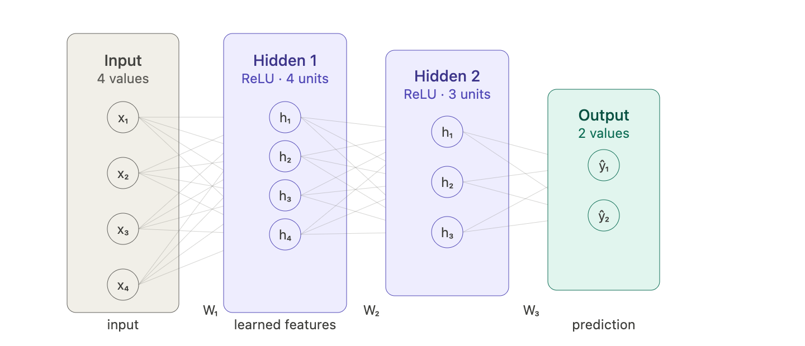
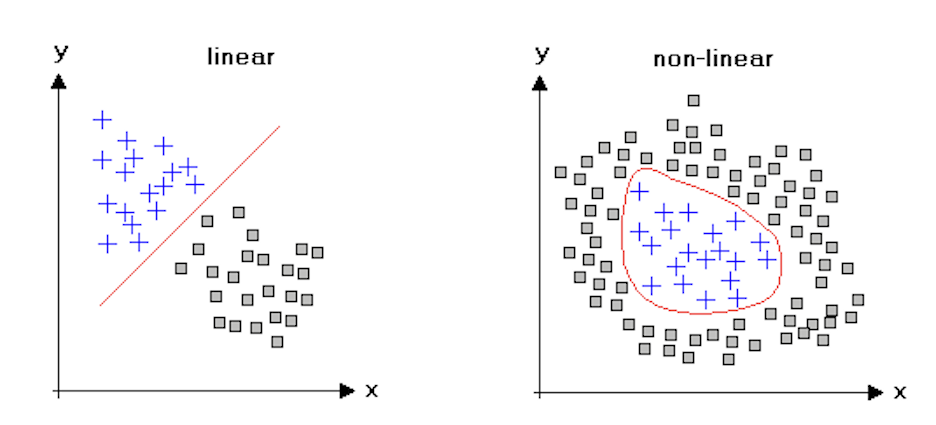
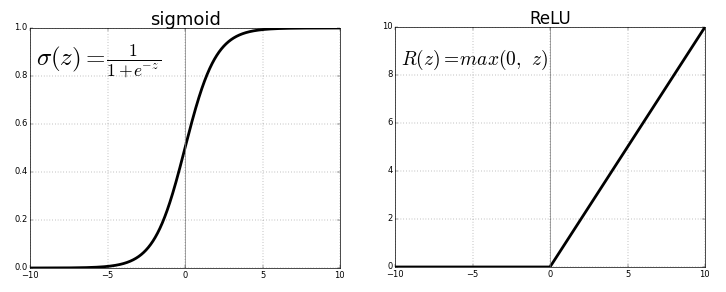
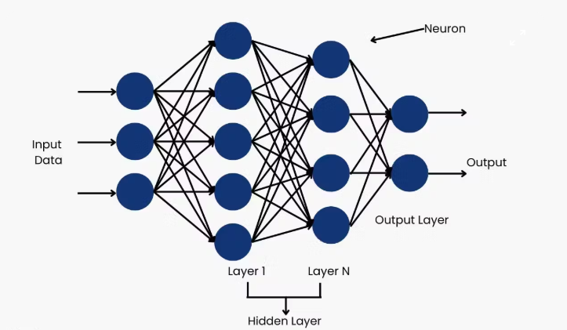
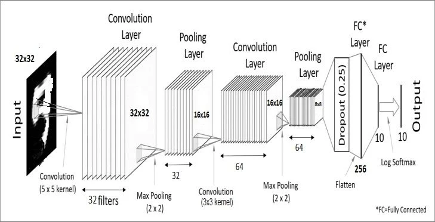

# Intro to Machine Learning

This repo uses several pre-trained machine learning models. You do not need to train anything — someone else already spent weeks and a lot of electricity doing that — but you do need to understand what these models *are*, what it means to run them, and why they produce the outputs they do. Later in your undergrad years you will have a chance to take CS343, which will teach you the basics of Neural Networks properly. This document is the appetizer.

---
## What Is a Neural Network?

A neural network is a function. It takes numbers in, does a lot of math, and gives numbers out. What makes it interesting is that the math is *learned*. The exact operations are not written by a programmer but discovered automatically by running the network on millions of examples and nudging it toward better answers.

More concretely: a neural network is a function with millions (or billions) of stored numerical parameters called **weights**. These weights are organized into **layers**. Each layer takes its input, applies a weighted sum across every input value, adds a constant (called a **bias**), and then applies a non-linear function called an **activation function**. That output becomes the input to the next layer.



## What Is an Activation function?
A neural network is essentially a giant sandwich of matrix multiplications. But there’s a catch: in linear algebra, if you multiply a number by a weight, then multiply it by another weight, you could have just multiplied it by one larger weight from the start. Mathematically, it looks like this:

$$f(g(x)) = W_2(W_1x) = (W_2W_1)x = W_{new}x$$

Without an activation function, a 100-layer neural network is mathematically identical to a 1-layer network. It would only be able to learn "linear" relationships, essentially drawing straight lines through data. The activation function is the "secret sauce" that breaks this linearity.



The activation function is what makes neural networks powerful, and its design is inspired from human cognition. In biological brains, a neuron doesn't just pass on every signal it gets. It waits until the input reaches a certain threshold, then it "fires." Artificial activation functions mimic this by acting as a gatekeeper:
- They allow the network to create "bends" and "curves" in its logic. By combining millions of these small bends, the network can approximate incredibly complex shapes (like the pixels of a face or the structure of a sentence).
- They decide if a neuron’s input is important enough to be passed to the next layer.

The most common activation function in modern networks is **ReLU** (Rectified Linear Unit), which is embarrassingly simple:



Why does something this simple work? Because stacking many ReLUs together can approximate any shape, a piecewise linear approximation to any function you want. And it is fast to compute, which matters when you are doing it billions of times.

Other activation functions you will encounter: **GELU** (used in Transformers, smoother than ReLU), **Sigmoid** (squashes to 0–1, used for probabilities), **Softmax** (turns a vector of numbers into a probability distribution that sums to 1, used in classification heads).

Stack many neurons into a layer, stack many layers in sequence, and you get a **deep neural network**. The "deep" just means "many layers." Ten years ago "deep" meant 5–10 layers and was novel. Today's models have hundreds.

---

## MLP — Multi-Layer Perceptron

The simplest deep network is an **MLP**: a chain of fully-connected (also called "dense") layers. "Fully connected" means every neuron in layer N is connected to every neuron in layer N+1.

$$
\mathbf{h}^{(l)} = \sigma\!\left(W^{(l)}\mathbf{h}^{(l-1)} + \mathbf{b}^{(l)}\right)
$$

In code, this is just a matrix multiply followed by an activation:

```python
import torch
import torch.nn as nn

mlp = nn.Sequential(
    nn.Linear(256, 512),   # W: (512, 256), b: (512,)
    nn.ReLU(),
    nn.Linear(512, 512),
    nn.ReLU(),
    nn.Linear(512, 128),   # output: 128-D embedding
)

x = torch.randn(32, 256)  # batch of 32 inputs, each 256-D
out = mlp(x)              # shape (32, 128)
```



MLPs appear constantly as components inside larger architectures: projection heads, classification heads, the Q-Former inside BLIP-2. Everywhere there is a need to "transform this vector into a different vector of a different size through some functions," an MLP is doing it.

---

## Training vs Inference

### Training

Training is the process of finding the weights. You start with random weights, run the model on labeled data, compute how wrong the output is (the **loss**), and use calculus (specifically: backpropagation + gradient descent) to adjust every weight slightly in the direction that reduces the error. Repeat this millions of times on millions of examples.

```
Training loop (runs millions of times):

  batch of data ──► forward pass ──► prediction ──► loss function
                                                          │
                        weights ◄── gradient update ◄── gradients
                        (nudged slightly)
```

The **loss function** is the formal definition of "wrong." For classification, it is typically cross-entropy. For regression, mean squared error. For image generation, something much more exotic. The loss collapses everything the network got wrong on this batch down to a single number, which is what makes the gradient computation tractable.

**Gradient descent** works because the loss is a differentiable function of the weights. You can compute the gradient — a vector pointing in the direction of steepest ascent in loss — and step in the opposite direction. Do this enough times and you roll downhill into a (local) minimum.

Training a modern vision model requires: large labeled datasets (millions of images), GPUs with tens of GB of VRAM, days to weeks of compute time, and significant electricity bills. This is why you are not doing it. Someone already did, and saved the result.

### Inference

**Inference** is running the pre-trained model on new data to get predictions. You load the weights from disk, set the model to evaluation mode (which disables certain training-specific behaviors like dropout), and run the forward pass.

```python
import torch

model.eval()               # turn off dropout, batchnorm uses running stats
with torch.no_grad():      # disable gradient tracking — saves memory and speeds up
    output = model(input)
```

Two things `model.eval()` actually does that matter:

- **Dropout**: During training, dropout randomly zeroes out neurons with some probability — this prevents the network from relying too heavily on any single path and acts as regularization. At inference you want all neurons active, so `eval()` disables dropout.
- **BatchNorm**: Batch normalization normalizes activations using the statistics of the current batch during training. At inference, it uses running statistics accumulated during training instead, which is what you want when processing single images.

`torch.no_grad()` tells PyTorch not to track operations for gradient computation. This halves memory usage and speeds things up significantly. Always use it during inference.

A **checkpoint** is a file (`.pt` or `.pth`) containing the serialized weight tensors. This is why `configs/main_config.yml` has entries like `paths.yolo8_ckpt` — when the model is initialized, it loads weights from that file. The architecture (layer structure) is defined in code; the learned knowledge lives in the checkpoint.

```python
# Loading a checkpoint — what happens under the hood
model = MyModel()                         # architecture with random weights
state_dict = torch.load("weights.pt")    # dict mapping layer names → tensors
model.load_state_dict(state_dict)         # replace random weights with trained ones
model.eval()                              # now ready for inference
```

---

## Embeddings

An **embedding** is a fixed-length vector of floating-point numbers that a neural network produces as a compressed representation of its input. Think of it as a numerical fingerprint.

```
Image ──► Neural Network ──► [0.12, −0.83, 0.04, 0.71, …, 0.67]
                                         ↑
                              embedding vector (e.g. 768 numbers)
```

The length of the vector (768, 512, 1024, etc.) is called the **embedding dimension**. It is a hyperparameter of the model architecture and is fixed — every input produces an embedding of exactly this length regardless of input size.

The crucial property that makes embeddings useful: **similar inputs produce similar (nearby) embeddings**.

"Similar" has a specific geometric meaning: the distance between the two vectors in 768-dimensional space is small. The typical distance metric used is cosine similarity — the angle between the vectors — rather than Euclidean distance, because direction encodes meaning more reliably than magnitude.

$$
\text{cosine\_similarity}(\mathbf{a}, \mathbf{b}) = \frac{\mathbf{a} \cdot \mathbf{b}}{\|\mathbf{a}\| \|\mathbf{b}\|}
$$

```python
import torch
import torch.nn.functional as F

emb_a = model(image_of_chair_from_left)     # shape (768,)
emb_b = model(image_of_chair_from_right)    # shape (768,)
emb_c = model(image_of_car)                 # shape (768,)

sim_ab = F.cosine_similarity(emb_a.unsqueeze(0), emb_b.unsqueeze(0))  # high — same object
sim_ac = F.cosine_similarity(emb_a.unsqueeze(0), emb_c.unsqueeze(0))  # low — different
```

In the repo, embeddings are how the tracker decides whether a new detection matches an existing tracked object. If you see an object in frame 10 and the same object in frame 11 from a slightly different angle, their embeddings will be close together even though the pixel values are very different. This is the whole point — embeddings are invariant to the surface-level variation and capture the underlying identity.

```
Embedding space (simplified 2D projection of 768D reality):

   · ·  ·                  ← chair embeddings cluster here
   ·

          · · ·             ← table embeddings cluster here

                   · ·      ← cup embeddings cluster here
```

The clusters form during training because the model is trained to produce similar embeddings for similar inputs (and different embeddings for different inputs). Different models have different notions of "similar": DINOv2 was trained on image-level similarity, SigLIP was trained on image-text pairs, so it knows that "a photo of a chair" should be close to an embedding of an actual chair.

### The Embedding Dimensionality Tradeoff

Higher-dimensional embeddings can encode more nuance but are more expensive to store and compare. In practice, 512–1024 is standard for vision models. The embedding space has structure — you can do arithmetic in it. The classic example is from word embeddings: `king - man + woman ≈ queen`. Vision embeddings have analogous structure but are harder to interpret intuitively.

---

## Convolutional Neural Networks (CNNs)



For images, plain MLPs are wasteful. An MLP treats every pixel independently — a pixel at the top-left has no special relationship with the pixel next to it. Images have **spatial locality**: edges, textures, and shapes are made of nearby pixels. CNNs exploit this.

### Convolution

A convolutional layer applies a small **filter** (also called a kernel) — typically 3×3 or 5×5 — to every position in the image. The filter has learned weights. It slides across the image, computing the dot product between its weights and the local image patch at each position.

```
3×3 filter (learned weights) sliding over an image:

  Image patch:          Filter weights:
  [p₁  p₂  p₃]         [w₁  w₂  w₃]
  [p₄  p₅  p₆]    ⊙    [w₄  w₅  w₆]  ──► one output value
  [p₇  p₈  p₉]         [w₇  w₈  w₉]

  output value = p₁w₁ + p₂w₂ + ... + p₉w₉ + bias
```

The key insight: **the same filter weights are used at every position in the image**. This is called weight sharing, and it is what makes CNNs so much more efficient than MLPs for images. A 3×3 filter has only 9 parameters, but it scans the entire 640×480 image, producing a feature map of the same spatial size. Equivalent with a fully-connected layer would require millions of parameters.

A convolutional layer has multiple filters running in parallel — each one learns to detect a different pattern. The output is a 3D tensor: `(height, width, num_filters)`.

```
What different filters learn (roughly):

  Early layers (close to input):
    Filter 1 → detect horizontal edges
    Filter 2 → detect vertical edges
    Filter 3 → detect specific colors or color transitions
    Filter 4 → detect diagonal gradients
    ...

  Middle layers:
    Filters combine early features → detect corners, curves, textures

  Late layers (close to output):
    Filters combine mid-level features → detect object parts
    (wheels, faces, windows, legs...)
```

This hierarchy is one of the most important ideas in deep learning — early layers learn primitive features, and later layers assemble those into increasingly abstract concepts. Nobody programs this in; it emerges from training.

### Pooling

CNNs interleave convolutional layers with **pooling layers**, which downsample the spatial dimensions. Max pooling takes the maximum value in each 2×2 window and discards the rest, halving height and width. This makes the network progressively more spatially invariant — small shifts in the object's position don't change the output.

```
Max pooling (2×2, stride 2):

  Input (4×4):          Output (2×2):
  [3  1  2  4]
  [6  2  1  3]  ──►   [6  4]
  [1  4  3  2]          [4  7]
  [2  3  7  1]
```

### Why CNNs for Detection and Segmentation

YOLO and SAM both use CNN backbones because detection and segmentation require spatial output — you need to know *where* in the image something is, not just *what* is in the image. CNNs preserve spatial information through their architecture. The output feature maps from a CNN backbone have spatial correspondence with the input image: a feature at position (i, j) in the feature map corresponds to a region centered at a predictable location in the original image.

```python
# A simplified view of YOLO's pipeline:
# 1. CNN backbone extracts feature maps at multiple scales
# 2. Neck (feature pyramid) combines scales
# 3. Head predicts: class, confidence, bounding box (x,y,w,h) at each position

features = backbone(image)             # (B, C, H/32, W/32) — spatially downsampled
detections = detection_head(features)  # (B, num_anchors, 5 + num_classes)
```

---

## Transformers

The **Transformer** architecture is the foundation of DINOv2, BLIP-2, SigLIP, and every LLM. It was originally invented for text (the famous "Attention Is All You Need" paper, 2017) and then applied to images by breaking them into patches and treating each patch as a token. The key idea is **self-attention**. You don't really need to know about this, but you should watch some video explaining it. All LLMs are built on top of this model.

!!! Additional "references"
    - https://www.youtube.com/watch?v=wjZofJX0v4M
    - https://www.youtube.com/watch?v=ZXiruGOCn9s&t
    - https://www.youtube.com/watch?v=SZorAJ4I-sA