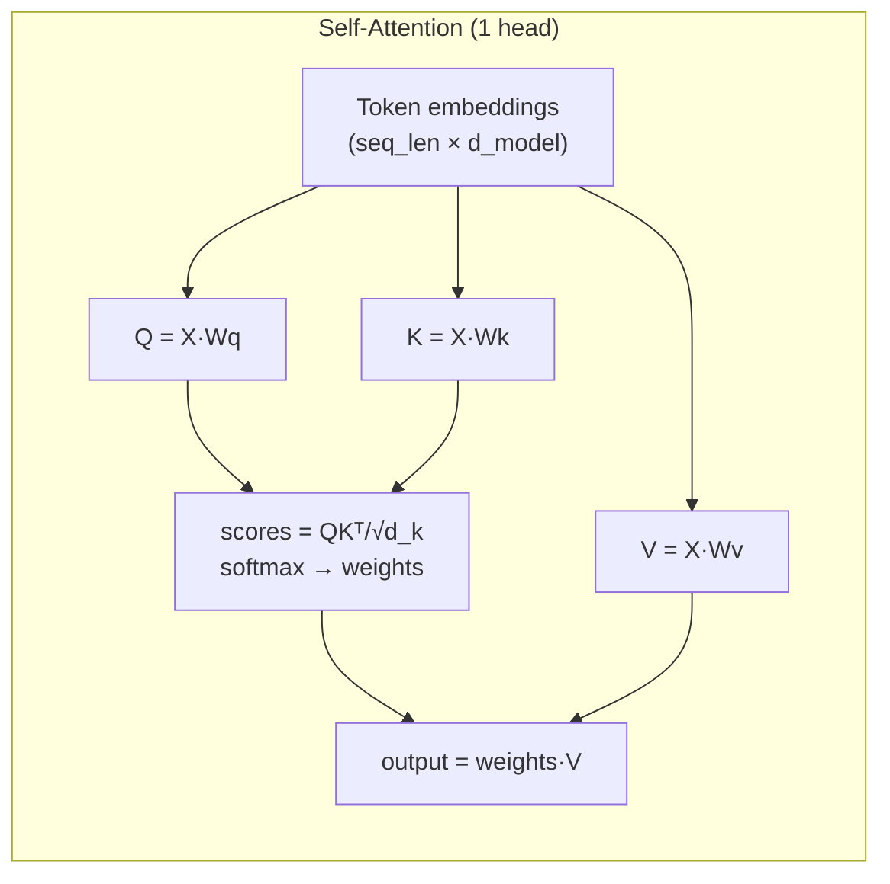

# Intro to NLP

Language is the original compression algorithm. In a few words you can communicate something that would take thousands of pixels to show visually — "the red chair is to the left of the wooden desk" tells a robot almost everything it needs to navigate, in 14 tokens. Natural Language Processing is the field that gave computers the ability to work with that compression. For this repo, NLP shows up in two places: **generating captions** for detected objects, and **extracting spatial relations** between them. Both tasks would have been nearly impossible five years ago and are now handled by models that cost $0.001 per query.

---

## Large Language Models (LLMs)

An **LLM** is a neural network trained on internet-scale text with one objective: predict the next token. That sounds underwhelming. It is not. By training to predict the next token on trillions of words of human writing, the model implicitly learns grammar, facts, reasoning, coding, and how to follow instructions — because all of that information is encoded in the statistical structure of text.

```
LLM: next-token prediction

  Input:  "The cup is on top of the"
  Output: "desk"  (most likely next token given all context)

  Chain many predictions together → full sentence generation
  This is called "autoregressive decoding"
```

The model has no symbolic understanding of "cup" or "desk." It has statistical patterns learned from billions of examples of humans describing physical spaces. But the emergent result is good enough that you can ask it spatial reasoning questions and get reliable answers.

### Tokens and Tokenization

LLMs do not process characters or words — they process **tokens** (roughly word pieces). A tokenizer splits text into sub-word units and maps each to an integer ID. Why sub-words? Because a vocabulary of whole words has millions of entries (every proper noun, every conjugation, every misspelling), while a vocabulary of ~50,000 sub-word pieces covers almost all text with short sequences.

```
"the laptop is on the desk"
  →  ["the", " laptop", " is", " on", " the", " desk"]
  →  [  264,    21132,    374,    389,    264,   15051]  (token IDs)

"electromagnetic"
  →  ["electro", "magnetic"]   ← split at a sub-word boundary
  →  [14192, 9492]
```

A common trap: when you feed a prompt to an LLM API, you are billed by tokens, not by characters. Long object descriptions with unusual words cost more because they tokenize into more pieces. Keeping relation-extraction prompts short matters for cost.

### How This Repo Uses LLMs

After building the 3D map, for each pair of nearby objects the LLM (Llama-4 via Groq API or GPT-4o via OpenAI) is given image crops and 3D positions and asked to identify the spatial relation:

```
Prompt:
  "Object A is a laptop at position [1.2, 1.8, 0.82].
   Object B is a desk  at position [1.2, 2.0, 0.75].
   What is the spatial relation from A to B?
   Choose one: on_top_of / left_of / near / in_front_of / ..."

Response: "on_top_of"
```

The LLM needs no fine-tuning for this. It reasons from its pre-training knowledge of how physical objects relate to each other. The `relation_votes` config key (default: 3) runs the same query multiple times and takes the majority vote — LLMs are stochastic, and averaging reduces noise.

---

## Transformers and Self-Attention

Every modern language model — and most vision models — is built on the **Transformer** architecture (Vaswani et al., 2017, "Attention Is All You Need"). The core mechanism is **self-attention**, which lets every position in a sequence look at every other position and decide how much to attend to it.

```
Self-attention (simplified):

  Input sequence: ["the", "cup", "is", "on", "the", "desk"]
                     │      │     │     │      │      │
                     ▼      ▼     ▼     ▼      ▼      ▼
  Each token produces three vectors:
    Q (query)  — "what am I looking for?"
    K (key)    — "what do I contain?"
    V (value)  — "what do I want to pass on?"

  Attention score between token i and token j:
    score(i, j) = softmax( Qᵢ · Kⱼ / √d_k )

  Output for token i:
    output_i = Σⱼ score(i, j) × Vⱼ
```

In plain English: each token broadcasts a query ("I am 'on', what prepositions usually attach to?"), every other token responds with its key ("I am 'cup', I often appear after spatial prepositions"), and the output at each position is a weighted average of all values. This lets "cup" and "desk" attend strongly to "on" — and "on" to both — regardless of how far apart they are in the sequence.



**Multi-head attention** runs this in parallel with different learned weight matrices, then concatenates the results. Each head learns to attend to different types of relationships (syntactic, semantic, positional, etc.). GPT-4 has 96 attention heads per layer.

!!! tip "Why not RNNs?"
    Earlier sequence models (LSTMs, GRUs) processed tokens left-to-right one at a time. This made it hard to relate tokens that were far apart in the sequence (the gradient has to flow back through every step in between). Self-attention is O(n²) in sequence length but connects any two positions in a single operation. For long documents, this is a massive win. For very long sequences (>32k tokens), modern techniques like sliding window attention and sparse attention manage the quadratic cost.

---

## Encoders

A **text encoder** converts a string into a fixed-length embedding vector — identical concept to image embeddings from the ML page, but for text.

```
Text encoder:

  "a black office chair"  ──► encoder ──► [0.21, −0.44, 0.07, …]
                                                  ↑
                                          512-D vector

  "a wooden desk"         ──► encoder ──► [0.05,  0.31, −0.12, …]

  cosine_similarity("a black office chair", "a wooden desk") ≈ 0.35
  cosine_similarity("a black office chair", "a dark swivel chair") ≈ 0.87
```

SigLIP has both an image encoder and a text encoder that map into the **same** vector space. This means you can directly compare an image to a text description — they land in the same embedding dimension and cosine similarity is meaningful across modalities.

---

## Cosine Similarity

The standard way to compare two embedding vectors is **cosine similarity**:

$$
\text{sim}(\mathbf{a}, \mathbf{b}) = \frac{\mathbf{a} \cdot \mathbf{b}}{\|\mathbf{a}\|\,\|\mathbf{b}\|}
$$

It measures the **angle** between two vectors, regardless of their magnitude:

```
sim = +1.0  →  same direction  (identical or near-identical meaning)
sim =  0.0  →  perpendicular   (unrelated concepts)
sim = −1.0  →  opposite        (antonyms or contradictory meaning)
```

Why angle and not Euclidean distance? Because embedding magnitudes are not meaningful — a long embedding vector of "chair" is not "more chair" than a short one. The direction is everything.

```python
import numpy as np

def cosine_sim(a: np.ndarray, b: np.ndarray) -> float:
    return np.dot(a, b) / (np.linalg.norm(a) * np.linalg.norm(b))

# Between all pairs of N embeddings at once (vectorized)
# a: (N, D)  — N query vectors
# b: (M, D)  — M database vectors
a_n = a / np.linalg.norm(a, axis=1, keepdims=True)   # L2-normalize each row
b_n = b / np.linalg.norm(b, axis=1, keepdims=True)
sim_matrix = a_n @ b_n.T    # (N, M) — all pairwise cosine similarities in one matmul
```

This is how **object tracking** works: a new detection's SigLIP embedding is compared to all tracked objects. The one with the highest cosine similarity is the match candidate.

---

## Vector Search (Nearest Neighbor)

Once every item in a database has an embedding, finding the most similar item to a query is just: *which vector in the database is closest to my query vector?* This is called **nearest-neighbor search** (or approximate nearest-neighbor, ANN, when the database is large enough that exact search is too slow).

```
Database embeddings (one per reference frame):

  Frame 0   ─────────────────────────────────► ·
  Frame 1   ──────────────────────► ·
  Frame 2   ──────────────────────────────────────► ·
  ...

  Query     ──────────────────────────────────► ·
                                              ↑ closest to Frame 0

  Best match = Frame 0  →  robot is near Frame 0's recorded position
```

In this repo, **FAISS** (Facebook AI Similarity Search) handles the ANN search. FAISS indexes all database embeddings once and returns top-k nearest neighbors in microseconds, even for databases with millions of vectors. Without ANN indexing, you would be computing millions of cosine similarities sequentially on every query frame — which does not scale to real-time localization.

---

## VLAD: Aggregating Many Vectors Into One

DINOv2 produces **196 patch embeddings** per image (one per 16×16 patch). To get a **single descriptor** for place retrieval, we need to aggregate them. VLAD (Vector of Locally Aggregated Descriptors) does this by comparing each patch to a set of learned cluster centers.

$$
\mathbf{V}_k = \sum_{\substack{i\;\colon\\\text{NN}(\mathbf{f}_i) = k}} (\mathbf{f}_i - \mathbf{c}_k)
$$

1. **Offline (one-time setup)** — K-Means cluster all patch embeddings from the training database into $K$ cluster centers $\mathbf{c}_1, \ldots, \mathbf{c}_K$ (default $K=32$ in config)
2. **Per image** — assign each of the 196 patches to its nearest cluster, accumulate residuals (patch − center) per cluster
3. Concatenate all $K$ blocks and L2-normalize

```
VLAD construction:

  196 patch embeddings
       │
       ▼
  Assign each patch to nearest cluster (out of K=32)
       │
       ▼
  For cluster k: sum up (patch − center_k) for all patches assigned to k
       │
       ▼
  Concatenate → [V₀ | V₁ | … | V₃₁]  (32 × D values)
       │
       ▼
  L2-normalize → compact descriptor for the whole image
```

Why is this better than just using the CLS token? The CLS token gives a single holistic summary that loses spatial detail. VLAD preserves information about *which parts* of the image look which way — two rooms that happen to have the same average appearance but different spatial layout will get different VLAD descriptors.

---

## Summary: NLP / Language Components in the Repo

| Component | Model | Task | Where |
|-----------|-------|------|-------|
| Relation extraction | Llama-4 (Groq) or GPT-4o | Object-pair spatial relations | `models/llm.py` |
| Image + text embedding | SigLIP | Cross-modal similarity | `models/embedding.py` |
| Object captioning | BLIP-2 | Natural language labels | `models/captioning.py` |
| VLAD aggregation | (math, no model) | Single image descriptor | `localization/` |
| ANN search | FAISS | Nearest-neighbor retrieval | `localization/dataset.py` |

!!! tip "Where this shows up in the repo"
    - `models/llm.py` — wraps Groq and OpenAI APIs, implements majority-vote relation extraction
    - `models/captioning.py` — BLIP-2 multi-view captioning with top-crop selection
    - `models/embedding.py` — SigLIP image and text encoders, cosine similarity
    - `localization/dataset.py` — FAISS index construction and VPR database
    - `configs/main_config.yml` — `relation_llm`, `relation_votes`, `vpr_aggregation`, `vlad_clusters`
