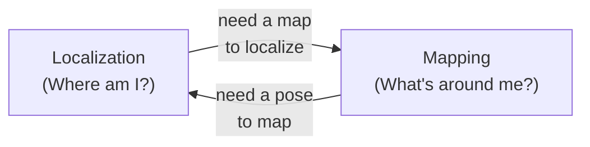
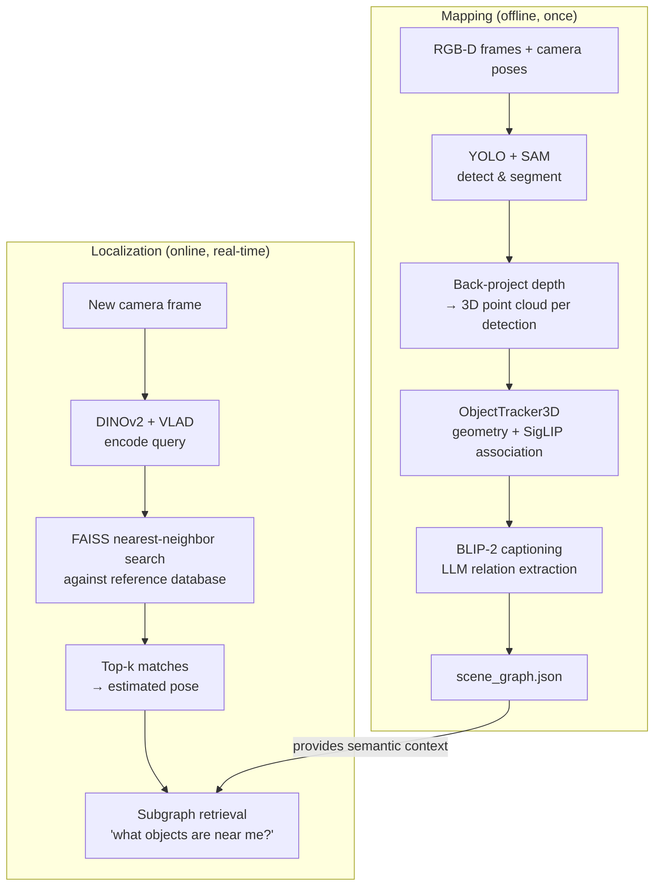

# Open Problems in Robotics

If you are reading this, you are probably here because you want to understand what makes autonomous robotics hard. The honest answer is: almost everything. Robots have to perceive the world through imperfect sensors, estimate their own location without GPS, build maps of environments that change, and make decisions in real time — all simultaneously, all while something is mechanically vibrating.

Two of the oldest and hardest unsolved problems are **localization** and **mapping**. This repo directly addresses both. Understanding why they are hard will help you appreciate every design decision in the codebase — and understand why the "obvious" solutions do not actually work.

---

## The Core Challenge

A robot navigating the real world needs to answer two questions at all times:

```
1. Where am I?                      ← Localization
2. What does the world look like?   ← Mapping
```

These questions are deeply intertwined: to build an accurate map you need to know where you are, and to know where you are you need a map. This chicken-and-egg dependency is called the **SLAM problem** (Simultaneous Localization And Mapping). It has been studied since the late 1980s and remains an active research area. Not because people are slow — because the problem is genuinely hard.



---

## Localization

**Localization** is the problem of estimating the robot's position and orientation (its **pose**) in a known or partially-known environment.

### Why Not Just Use GPS?

GPS is the obvious answer, and it is wrong for two reasons:

1. **Indoors.** GPS requires line-of-sight to at least 4 satellites. Concrete walls and ceilings attenuate the signal to unusable levels. A robot navigating a hospital, warehouse, or university building has zero GPS signal most of the time.

2. **Accuracy.** Consumer GPS is accurate to ±3–5 meters under ideal conditions. A robot navigating a room with 0.8-meter-wide doorways needs centimeter-level accuracy. RTK-GPS can get to centimeters, but requires expensive fixed base stations and still does not work indoors.

### Dead Reckoning and Drift

The simplest localization method: integrate the robot's velocity over time. Know your starting position, track how fast and which way you moved, update your estimate.

```
Dead reckoning:

  Start at [0, 0, 0°]
  Drive forward 1 m  → estimated position [1, 0, 0°]
  Turn left 90°      → estimated position [1, 0, 90°]
  Drive forward 2 m  → estimated position [1, 2, 90°]
  ...

  Every step is: new_pose = old_pose + ΔT(velocity × dt)
```

The problem: **every sensor reading has a small error, and those errors accumulate**. A 1% error in wheel odometry means a 1-meter error after driving 100 meters. Turn slightly more than you thought, and every subsequent position estimate is rotated by that much. This is called **drift**, and it is unavoidable with dead reckoning alone.

```
Drift over time:

  True path:        ──────────────────────────────────────►
  Estimated path:   ────────────────╱──────────╱────────────
                                 drift      more drift

  Error grows roughly as √(distance traveled)
  1% error, 100 m traveled → ~1 m position error
  1% error, 10 km traveled → ~10 m position error
```

Spot's on-board state estimator is excellent — it fuses wheel odometry, IMU, and foot contact forces at 200 Hz. But it still drifts. After a 10-minute exploration session, the accumulated error can be several centimeters to tens of centimeters depending on terrain.

### Visual Place Recognition (VPR) as a Fix

**VPR** corrects drift by matching the current camera view against a database of frames with known ground-truth positions. When a match is found, you get an absolute position estimate — resetting the accumulated drift.

```
VPR corrects drift:

  Dead reckoning: "I think I'm at [3.2, 1.1, 0.0]"
                         │
                         ▼  DINOv2 + VLAD encode current frame
                         ▼  compare to database of reference frames
                         │
  Best match: Frame 47  →  "This view was recorded at [3.0, 0.9, 0.0]"
                         │
  Corrected pose: [3.0, 0.9, 0.0]   drift reset
```

This is the approach used in this repo. The VPR module retrieves not just a position but also the nearby scene graph subgraph — so the robot can answer "what objects are near me right now?" immediately after localization.

### Why Localization Is Hard (The Short List)

| Challenge | Why it's difficult |
|-----------|-------------------|
| **Perceptual aliasing** | Two different places look nearly identical (long corridor with identical doors every 3 m) |
| **Dynamic environments** | People walk through the scene; furniture gets rearranged; the map is outdated |
| **Viewpoint change** | The same location looks very different when approached from a different angle or height |
| **Lighting variation** | Fluorescent vs. natural light changes pixel values drastically — a model trained in the morning may fail at night |
| **Computational latency** | Encoding a query frame and searching a database of thousands must complete in <100 ms for real-time use |
| **Scale** | A real building has hundreds of rooms — the database grows linearly, but search time should not |

---

## Mapping

**Mapping** is the problem of building a useful representation of the environment from sensor data — one that is accurate, compact, and actionable.

### The Representation Hierarchy

Not all maps are equally useful. There is a spectrum from raw geometry to rich semantics:

```
Geometric maps (where are the surfaces?):

  Occupancy grid ──► 2D top-down: each cell = free | occupied | unknown
  Point cloud    ──► 3D: set of (x, y, z) points on surfaces
  Mesh           ──► 3D: triangulated surface (watertight, renderable)
  TSDF           ──► 3D: signed distance field in a voxel grid
                         → positive inside obstacles, negative outside
                         → can extract a mesh at the zero-crossing

Semantic maps (what does the world mean?):

  Labeled point cloud  ──► each point tagged with a class name
  Object-level map     ──► objects as 3D bounding boxes with class labels
  Scene graph          ──► objects as nodes, spatial relations as edges
                           ← what this repo builds
```

As you go up the hierarchy, maps become more useful for high-level tasks (natural language queries, task planning, navigation by landmark) but require more computation and more information to build.

### Why Not Just Stack Point Clouds?

A naïve map is the union of all back-projected depth frames. Every frame adds its points. Problems:

```
Problem 1: Drift corrupts alignment

  Frame 1   (true pose):     chair here → ●
  Frame 200 (drifted pose):  chair here →    ●
                                          ↑ ghost duplicate from drift
  Result: two ghost chairs instead of one

Problem 2: Scale

  A 5-minute RGB-D scan at 30 fps = 9000 frames
  A 256×192 depth frame = 49,152 pixels
  9000 × 49,152 = ~440 million points

  Most of those points are redundant — they describe the same surfaces
  from slightly different viewpoints. The map is 440M points and still
  does not tell you there is a chair.

Problem 3: No semantic meaning

  A point cloud tells you where the surfaces are.
  It cannot answer: "Is that surface a chair?"
                    "Is the laptop on top of the desk?"
                    "Which way is the exit?"
```

### The Scene Graph Approach

This repo builds a **semantic scene graph**: a compact, queryable, language-grounded map.

```
Semantic map (scene graph):

  [floor lamp] ──── near ────► [desk] ◄── on_top_of ── [laptop]
                                  │
                               left_of
                                  │
                               [chair]

  Each node: {
    id: 3,
    label: "desk",
    centroid: [1.2, 2.0, 0.75],
    caption: "a brown wooden desk with metal legs",
    point_cloud: (N, 3),
    edges: [...]
  }
```

A scene graph is:

- **Queryable in natural language** — "find all objects near the desk" → traverse edges from the `desk` node
- **Compact** — 20 object nodes instead of 40 million points
- **Drift-resistant** — each object's position is the centroid of all its merged point cloud observations; per-frame drift averages out over many views
- **Actionable** — a robot can plan a path or answer questions using object labels and relations without any vision model running at navigation time

### Why Semantic Mapping Is Hard (The Short List)

| Challenge | Why it's difficult |
|-----------|-------------------|
| **Object permanence** | The same chair seen from 100 different angles across 500 frames — which detections are the same object? |
| **Occlusion** | Objects partially hidden by other objects look completely different when half-visible |
| **Instance disambiguation** | Two identical chairs at opposite ends of the room — how do you track which is which? |
| **Relation ambiguity** | Is the cup "near" the laptop, "on top of" the desk, or both? The answer depends on viewpoint and definition |
| **Scale** | Real buildings have hundreds of objects — the tracker and scene graph must stay efficient |
| **Caption consistency** | BLIP-2 generates slightly different captions for the same object from different angles — which one is "the truth"? |

---

## How This Repo Addresses Both Problems



The two modules are intentionally decoupled:

- **Mapping** runs offline. You walk the robot through the environment once, build the scene graph, save it. Expensive models (BLIP-2, LLM) can run without a time constraint.
- **Localization** runs online at query time. The bottleneck is DINOv2 encoding + FAISS search, which together take ~50 ms on a modern GPU — fast enough for real-time navigation.

The scene graph acts as the "long-term memory" that localization can draw on. Once you have matched an image to a reference frame, the subgraph tells you not just "I am at position X" but "I am near the desk, which is next to the chair, which is left of the whiteboard."

---

## Open Research Questions

This is an active research area. A few open problems that this repo has not fully solved (and that nobody else has fully solved either):

**Lifelong mapping.** Environments change. The chair gets moved. The desk gets replaced. How do you update a scene graph without rebuilding it from scratch? Current approaches involve change detection and partial map updates, but robust lifelong semantic mapping is still an open problem.

**Semantic drift.** BLIP-2 captions are noisy — the same object gets described slightly differently depending on lighting, viewpoint, and model temperature. How do you build a consistent label when the labeler is stochastic? Majority voting helps; it does not fully solve it.

**Cross-scene generalization.** A VPR system trained on one building fails in a different building because the embedding space is not universal. Domain-adapted VLAD and contrastive fine-tuning help at the cost of requiring labeled data from the new environment.

**Real-time semantic mapping.** This repo runs mapping offline. Doing it in real time — running YOLO, SAM, SigLIP, BLIP-2, and the tracker at frame rate — requires careful pipelining and hardware. This is the direction the field is moving.

!!! tip "Further reading"
    - Cadena et al., "Past, Present, and Future of Simultaneous Localization And Mapping" (IEEE T-RO 2016) — the canonical SLAM survey
    - Gu et al., "ConceptGraphs" (arXiv 2023) — open-vocabulary 3D scene graphs (the closest published work to this repo's approach)
    - Sarlin et al., "HLoc: Hierarchical Localization" (CVPR 2019) — state-of-the-art VPR pipeline
