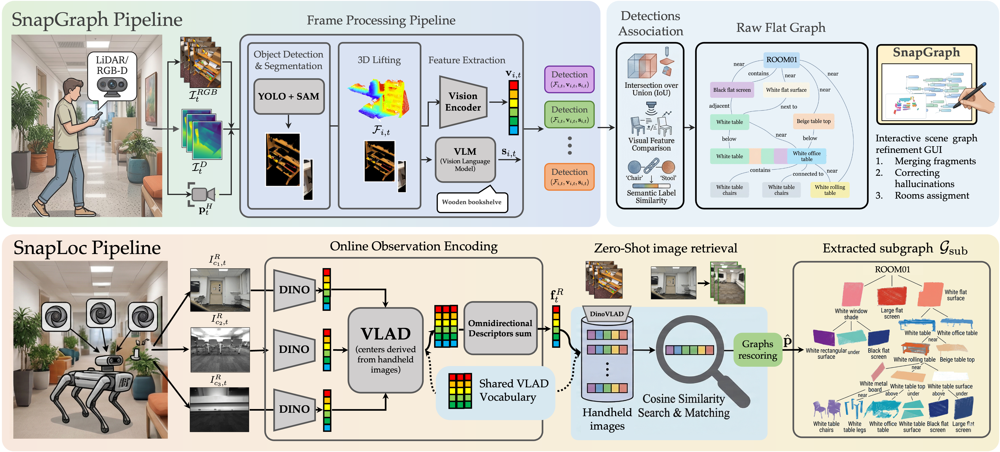
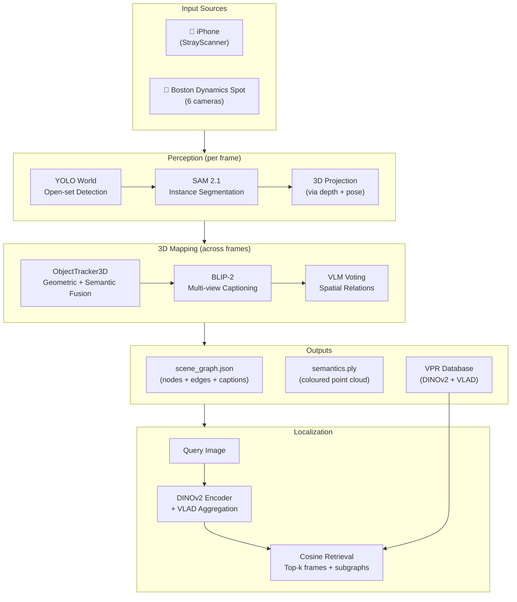
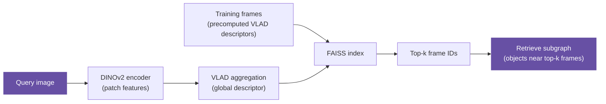

# System Architecture



Spot Semantic Mapping transforms raw RGB-D sensor streams into a structured 3D scene graph through a multi-stage pipeline. This page explains the overall architecture and how data flows through the system.

---

## High-Level Overview



---

## Stage 1 — Data Loading

The `core/io.py` module normalises inputs from both sensor types into a common format:

```
(rgb_frame, depth_frame, confidence_map, camera_intrinsics, pose_T_world_cam)
```

| Field | Shape | Description |
|-------|-------|-------------|
| `rgb_frame` | `(H, W, 3)` uint8 | BGR image |
| `depth_frame` | `(H, W)` float32 | Depth in metres |
| `confidence_map` | `(H, W)` uint8 | Depth reliability (0–2) |
| `camera_intrinsics` | `(3, 3)` | Focal length + principal point |
| `pose_T_world_cam` | `(4, 4)` | Camera-to-world SE(3) transform |

---

## Stage 2 — Per-Frame Perception

### YOLO Detection

[YOLO World](https://docs.ultralytics.com/models/yolo-world/) takes the RGB frame and a list of text class prompts, returning bounding boxes with confidence scores. The class list is fully configurable via `main_config.yml`.

```python
detections = yolo_model.detect(rgb_frame, classes=["chair", "table", ...])
# Returns: [(bbox_xyxy, confidence, class_name), ...]
```

### SAM Segmentation

Each bounding box from YOLO is passed as a **prompt** to [SAM 2.1](https://github.com/facebookresearch/segment-anything-2), which returns a precise per-pixel binary mask. This avoids background pixels entering the object's point cloud.

### 3D Projection

For each masked detection, valid depth pixels within the mask are back-projected into 3D using the camera intrinsics, then transformed to world coordinates using the camera pose. This yields a small point cloud per detected object.

---

## Stage 3 — Multi-Frame Fusion (ObjectTracker3D)

The tracker maintains a set of **MapObjects** — persistent 3D representations of observed objects. For every new detection arriving from a frame, it must decide:

1. Does this detection match an existing tracked object? → **association**
2. If yes, merge point clouds and update embeddings → **update**
3. If no, create a new MapObject → **initialisation**

### Association Score

```
score(new_det, existing_obj) =
    w_geo × IoU(pcd_new, pcd_existing)    # 3D point cloud overlap
  + w_sem × cosine(emb_new, emb_existing)  # CLIP visual similarity
```

Matches above `match_threshold` are associated. Matches above `merge_threshold` trigger a **loop closure merge** via Union-Find.

---

## Stage 4 — Captioning

Once tracking is complete, each MapObject's multi-view crops (all RGB crops from frames where the object was detected) are horizontally concatenated and passed to **BLIP-2**:

```
[crop_frame_5] [crop_frame_12] [crop_frame_31] ... → BLIP-2 → "a brown wooden chair with armrests"
```

This produces a natural-language description for every object node in the graph.

---

## Stage 5 — Spatial Relation Extraction

A KNN graph is built over the 3D object centroids. For each candidate pair of nearby objects, a VLM (Groq or OpenAI) is prompted with the objects' captions and spatial positions to vote on the relation type:

| Relation | Example |
|----------|---------|
| `left_of` | monitor is left_of keyboard |
| `on_top_of` | mug is on_top_of desk |
| `near` | chair is near table |
| `in_front_of` | robot is in_front_of door |

Relations confirmed by `relation_votes` or more VLM votes are added as directed edges.

---

## Stage 6 — Localization (VPR)

Visual Place Recognition localises a new query image within the built scene graph.



The retrieved subgraph contains the objects most likely to be visible from the query viewpoint.

---

## Module Map

```
spot_semantic_mapping/
│
├── configs/         Configuration YAML + loader singleton
├── core/            Geometry, I/O, masks, metrics, TSDF, visualisation
├── models/          Model wrappers (YOLO, SAM, DINOv2, SigLIP, BLIP-2, LLMs)
├── mapping/         Pipeline orchestration, tracker, relations, occupancy
├── localization/    VPR encoder, localizer, dataset builder, evaluation
└── spot/            Spot robot SDK interface, telemetry, dataset loading
```

---

## Data Flow Summary

| Stage | Input | Output | Key module |
|-------|-------|--------|-----------|
| Loading | Raw files on disk | Normalised RGB-D frames | `core/io.py` |
| Detection | RGB frame | Bounding boxes | `models/detection.py` |
| Segmentation | RGB + bbox | Binary masks | `models/segmentation.py` |
| Projection | Depth + mask + pose | Object point cloud | `core/geometry.py` |
| Tracking | All frame detections | MapObject list | `mapping/tracker.py` |
| Captioning | Multi-view crops | Text captions | `models/captioning.py` |
| Relations | Object centroids + captions | Directed edges | `mapping/relations.py` |
| Export | MapObject list | JSON + PLY | `mapping/pipeline.py` |
| VPR encoding | RGB frames | VLAD descriptors | `localization/encoder.py` |
| Retrieval | Query descriptor | Frame IDs + subgraph | `localization/localizer.py` |
