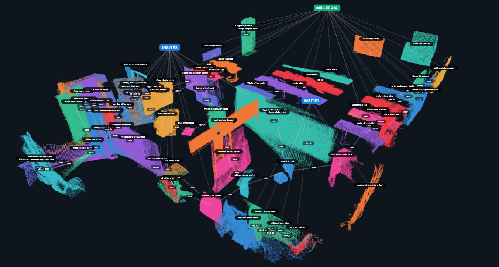

# Scene Graphs

A **3D scene graph** is a structured, graph-based representation of a physical environment. It captures not just *what* objects exist in a space, but *where* they are in 3D, *what they look like*, and *how they relate* to each other.



### Nodes

Each **node** represents a persistent 3D object:

| Field | Type | Description |
|-------|------|-------------|
| `id` | `int` | Unique object identifier |
| `label` | `str` | Class name from YOLO |
| `caption` | `str` | BLIP-2 natural-language description |
| `centroid` | `(x, y, z)` | 3D centre of mass in world coordinates |
| `bbox_3d` | `(min, max)` | Axis-aligned 3D bounding box |
| `point_cloud` | `N × 3` | Object point cloud (in world frame) |
| `embedding` | `D-dim` | SigLIP visual embedding for similarity queries |
| `confidence` | `float` | Average detection confidence across views |
| `num_views` | `int` | How many frames the object was detected in |

### Edges

Each **edge** is a directed spatial relation:

| Field | Type | Description |
|-------|------|-------------|
| `source_id` | `int` | Source node ID |
| `target_id` | `int` | Target node ID |
| `relation` | `str` | Relation type |
| `confidence` | `float` | VLM voting confidence |

---

## JSON Format

The scene graph is serialised to a single JSON file:

```json title="scene_graph.json"
{
  "nodes": [
    {
      "id": 0,
      "label": "chair",
      "caption": "a brown wooden chair with padded seat",
      "centroid": [1.21, 0.48, 0.82],
      "bbox_3d": {"min": [1.05, 0.12, 0.01], "max": [1.37, 0.83, 1.63]},
      "confidence": 0.87,
      "num_views": 14,
      "embedding": [0.021, -0.134, 0.089, ...]
    },
    {
      "id": 1,
      "label": "table",
      "caption": "a rectangular oak desk with metal legs",
      "centroid": [1.02, 1.18, 0.76],
      ...
    }
  ],
  "edges": [
    {"source": 0, "target": 1, "relation": "near",         "confidence": 0.95},
    {"source": 0, "target": 1, "relation": "in_front_of",  "confidence": 0.80}
  ]
}
```

---

## Loading and Querying

```python
from spot_semantic_mapping.mapping.io import load_scene_graph

graph = load_scene_graph("outputs/my_scene/scene_graph.json")

# Iterate nodes
for node in graph.nodes:
    print(node.id, node.label, node.caption)

# Find all edges from a node
edges_from_chair = [e for e in graph.edges if e.source == 0]

# Spatial query: objects within 2m of position (1, 1, 0)
import numpy as np
query_pos = np.array([1.0, 1.0, 0.0])
nearby = [n for n in graph.nodes
          if np.linalg.norm(np.array(n.centroid) - query_pos) < 2.0]
```

---

## Why Scene Graphs?

Traditional occupancy maps or raw point clouds tell you *where* space is free or occupied. Scene graphs additionally tell you:

- **What** objects are present (semantic labels + captions)
- **Where** each object is (3D centroid and bounding box)
- **How** objects relate spatially (`on_top_of`, `left_of`, etc.)
- **What they look like** (visual embeddings for similarity search)

This rich representation enables downstream tasks like:

- **Natural language navigation**: *"Go to the chair near the door"*
- **Object retrieval**: *"Where is the mug?"*
- **Semantic SLAM**: Updating a persistent map as the robot revisits areas
- **Scene understanding**: Counting furniture, detecting anomalies

---

## Further Reading
- [Semantic Mapping in Indoor Embodied AI -- A Survey on Advances, Challenges, and Future Directions](http://arxiv.org/abs/2501.05750)
- [3D Scene Graphs: A Structure for Unified Representations of Vision and Language (Armeni et al.)](https://arxiv.org/abs/1910.02527)
- [Hydra: A Real-time Spatial Perception Engine (Hughes et al., RSS 2022)](https://arxiv.org/abs/2201.13360)
- [ConceptGraphs: Open-Vocabulary 3D Scene Graphs (Gu et al., ICRA 2024)](https://arxiv.org/abs/2309.16650)
