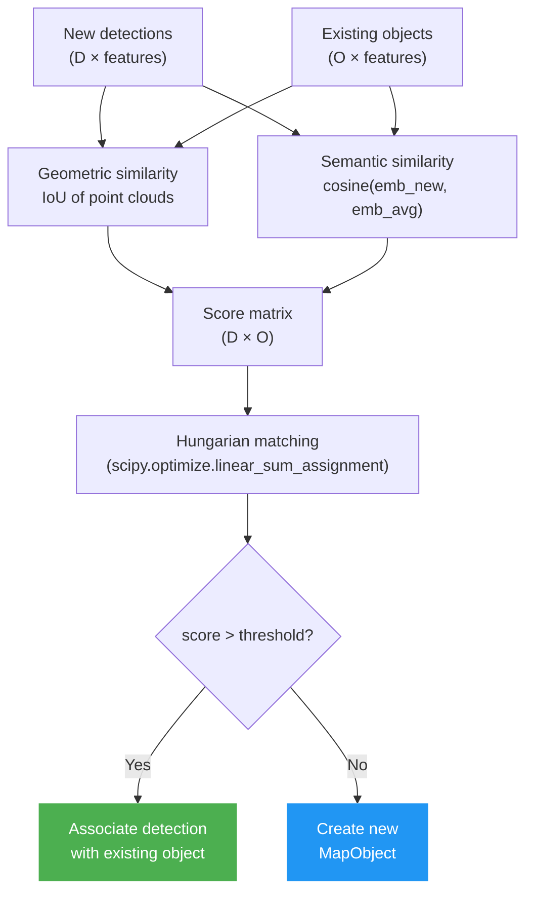
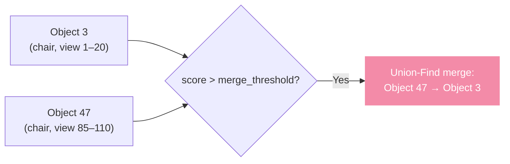

# Object Tracking

The `ObjectTracker3D` maintains a persistent set of 3D objects across hundreds or thousands of frames, fusing geometric and semantic information to decide when detections in different frames refer to the same real-world object.

---

## The Tracking Problem

A scene is observed from many viewpoints over time. The same chair may be detected in 50 different frames from 50 different angles. The tracker must answer for each new detection:

> **"Is this a new object, or have I seen this object before?"**

If it's seen before: merge the new point cloud into the existing object's model.
If it's new: initialise a new `MapObject`.

---

## Data Structures

### MapObject

```python
@dataclass
class MapObject:
    id: int
    label: str
    point_cloud: np.ndarray          # (N, 3) world-frame points
    embeddings: list[np.ndarray]     # SigLIP visual embeddings per view
    crops: list[np.ndarray]          # RGB crops for captioning
    num_views: int
    confidence: float
```

### Detection

```python
@dataclass
class Detection:
    label: str
    mask: np.ndarray                 # (H, W) binary mask
    point_cloud: np.ndarray          # (N, 3) projected 3D points
    embedding: np.ndarray            # SigLIP embedding of the crop
    confidence: float
    crop: np.ndarray                 # RGB crop (H×W×3)
```

---

## Association Algorithm

For every new frame, the tracker computes an association matrix between incoming detections and existing `MapObject`s, then solves a bipartite matching problem.



### Similarity Score

```python
score = (w_geo * iou + w_sem * cosine_sim) / (w_geo + w_sem)
```

| Component | What it captures |
|-----------|----------------|
| `iou` | Two detections occupy the same 3D space — strongly geometric |
| `cosine_sim` | Two detections look similar — handles lighting and texture changes |

Both weights default to `1.0` (equal balance). In environments with poor depth quality, increase `w_sem`. In texturally uniform environments, increase `w_geo`.

---

## Point Cloud IoU

IoU is computed on voxelised point clouds:

```python
def point_cloud_iou(pcd_a, pcd_b, voxel_size=0.05):
    vox_a = voxelise(pcd_a, voxel_size)
    vox_b = voxelise(pcd_b, voxel_size)
    return len(vox_a & vox_b) / len(vox_a | vox_b)
```

This is `O(N log N)` with the set operations but fast in practice because object clouds are small (hundreds–thousands of points per object).

---

## Loop Closure with Union-Find

When the robot revisits an area, the same object may have been tracked as two separate `MapObject`s (due to a viewpoint gap). A merge step identifies pairs of `MapObject`s with a score above `merge_threshold` and merges them using **Union-Find** (disjoint set union):



After merging, all frames that previously referenced Object 47 are re-attributed to Object 3, and the point clouds are concatenated.

---

## Object Pruning

After all frames are processed, objects with fewer than `min_views` observations are discarded. This removes:

- Spurious detections from a single blurry frame
- Objects partially visible at the scene boundary
- Low-confidence detections that weren't seen from multiple angles

```python
tracker.prune(min_views=cfg["min_views"])
```

---

## Tracking Configuration

```yaml
# Weights for association scoring
w_geo: 1.0
w_sem: 1.0

# Association thresholds
match_threshold: 0.4    # min score to associate a detection
merge_threshold: 0.7    # min score to merge two tracked objects

# Pruning
min_views: 3            # discard objects seen fewer than N frames

# DBSCAN for per-object point cloud cleanup
dbscan_eps: 0.1
dbscan_min_samples: 10
```

---

## Further Reading

- [ConceptGraphs: Open-Vocabulary 3D Scene Graphs for Perception and Planning (Gu et al., ICRA 2024)](https://arxiv.org/abs/2309.16650)
- [CLIP-Fields: Weakly Supervised Semantic Fields for Robotic Memory (Shafiullah et al., RSS 2023)](https://arxiv.org/abs/2210.05663)
