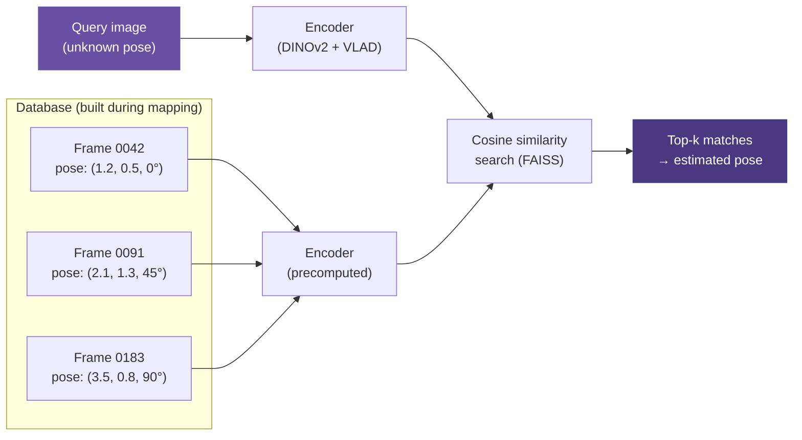
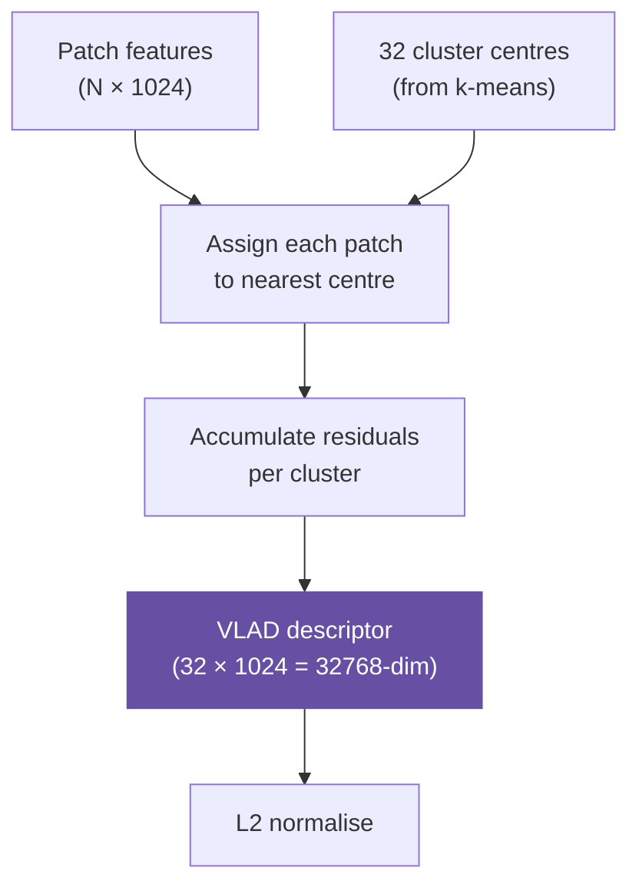

# Visual Place Recognition

**Visual Place Recognition (VPR)** is the task of determining *where* a robot is in a known environment, given only a camera image — no GPS, no odometry. It is the localization backbone of Spot Semantic Mapping.


---

## The Problem

Imagine a robot that has previously mapped an office. Days later, it enters the same office but doesn't know where it is. VPR lets it answer: *"Which part of the map does this image correspond to?"*



---

## DINOv2 Features

[DINOv2](https://github.com/facebookresearch/dinov2) (ViT-L/14) is a Vision Transformer trained with self-supervised learning on diverse internet images. It produces strong, transferable visual features without needing task-specific fine-tuning.

For each image, DINOv2 produces:

- **CLS token**: A single `1024-dim` global descriptor of the whole image.
- **Patch tokens**: `(H/14 × W/14)` local `1024-dim` descriptors — one per 14×14 pixel patch.

VPR uses **patch tokens** because they encode fine-grained local structure that is more robust to viewpoint change than global descriptors.

---

## VLAD Aggregation

Raw patch features form a `(N_patches, 1024)` matrix — too large to store or compare efficiently for every frame in a database. **VLAD** (Vector of Locally Aggregated Descriptors) compresses this into a single compact vector.

### How VLAD Works

1. **Train cluster centres** (visual vocabulary) by running k-means on patch features from a representative set of frames. This project uses `k=32` clusters.

2. **For each patch feature** in a new image, find its nearest cluster centre.

3. **Accumulate residuals**: For each cluster `c`, sum the difference between all patches assigned to `c` and the cluster centre `μ_c`:

```
VLAD_c = Σ_{x assigned to c} (x − μ_c)
```

4. **Concatenate** all cluster residuals → final descriptor of size `k × D = 32 × 1024 = 32768`.

5. **L2-normalise** the full VLAD descriptor.



### Why VLAD?

| Method | Descriptor size | Accuracy | Speed |
|--------|----------------|---------|-------|
| GAP (Global Average Pooling) | 1024 | Low | Fast |
| GeM | 1024 | Medium | Fast |
| **VLAD** (k=32) | 32768 | **High** | Medium |
| Domain-VLAD | 32768 | Highest | Slow |

VLAD preserves local structure that is lost in global pooling — a chair in the left half of the image contributes differently than one on the right.

---

## FAISS Index

[FAISS](https://github.com/facebookresearch/faiss) (Facebook AI Similarity Search) is a GPU-accelerated library for nearest-neighbour search in high-dimensional vector spaces. With `32768`-dim VLAD descriptors across thousands of frames, brute-force search would be too slow.

```python
import faiss

# Build index
dim = 32768
index = faiss.IndexFlatIP(dim)       # Inner product (= cosine similarity on L2-normalised vectors)
index = faiss.index_cpu_to_gpu(...)  # Move to GPU
index.add(database_descriptors)      # Add all training frame descriptors

# Search
distances, frame_ids = index.search(query_descriptor, k=5)  # top-5
```

---

## Subgraph Retrieval

Once top-k frames are identified, the system retrieves the **subgraph** — the subset of scene graph nodes visible from those frame positions:

```python
from spot_semantic_mapping.localization.localizer import retrieve_subgraphs

subgraph = retrieve_subgraphs(
    frame_ids=top_k_frame_ids,
    scene_graph=graph,
    window_radius=2.0,    # metres
)
```

Objects within `window_radius` metres of any top-k frame pose are included. This gives the robot a local semantic map anchored to its estimated position.

---

## Evaluation Metrics

VPR performance is measured with standard retrieval metrics:

### Recall@k

The fraction of query images for which at least one of the top-k retrieved frames is within a distance threshold `d` of the ground truth pose:

```
Recall@k = |{queries: ∃ frame ∈ top-k, dist(pose_frame, pose_gt) < d}| / |queries|
```

Typical thresholds: `d = 0.25 m` (indoor precision), `d = 1.0 m` (rough localisation).

### Median Localisation Error

The median Euclidean distance (in metres) between the ground truth pose and the pose of the top-1 retrieved frame.

```python
from spot_semantic_mapping.localization.evaluation import compute_metrics_from_scores

metrics = compute_metrics_from_scores(
    scores=similarity_matrix,        # (N_queries × N_db)
    ground_truth_pairs=gt_pairs,
    ks=[1, 5, 10],
    distance_thresholds=[0.25, 1.0],
)

print(metrics["recall@1@0.25"])     # e.g. 0.72
print(metrics["median_error"])      # e.g. 0.38 metres
```

---

## Further Reading

- [Visual Place Recognition: A Survey (Lowry et al., 2016)](https://ieeexplore.ieee.org/document/7339473)
- [VLAD: Aggregating local descriptors into a compact image representation (Jegou et al., CVPR 2010)](https://inria.hal.science/inria-00633013)
- [DINOv2: Learning Robust Visual Features without Supervision (Oquab et al., 2023)](https://arxiv.org/abs/2304.07193)
- [AnyLoc: Towards Universal Visual Place Recognition (Keetha et al., RAL 2023)](https://arxiv.org/abs/2308.00688)
