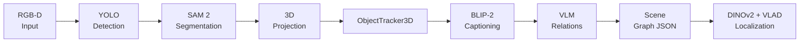

---
hide:
  - navigation
  - toc
---

# Spot Semantic Mapping

Build persistent 3D scene graphs from robot RGB-D streams — open-world detection, multi-view segmentation, VLM captioning, and visual place recognition in one pipeline.

**Supported sensors:** Boston Dynamics Spot (live + offline) · iPhone LiDAR via StrayScanner (offline)

[Get Started](getting_started/installation/){ .md-button .md-button--primary }
[View on GitHub](https://github.com/mhpham26/deployment_sem_mapping){ .md-button }

---

## Capabilities

-   **Open-World Detection**

    YOLO v8/v11 detects a fully configurable landmark vocabulary. SAM 2.1 refines each bounding box into a pixel-precise instance mask.

-   **3D Object Tracking**

    Depth back-projection creates per-object point clouds. `ObjectTracker3D` associates detections across frames using geometric overlap and CLIP visual similarity.

-   **Semantic Enrichment**

    Multi-view crops are captioned by BLIP-2. Spatial relations (`left_of`, `on_top_of`, `near`, `in_front_of`, …) are assigned by LLM voting over a KNN candidate graph.

-   **Visual Place Recognition**

    DINOv2 patch features aggregated with VLAD form compact place descriptors. Cosine retrieval maps a query image to its nearest scene subgraph.

---

## Pipeline

Each stage writes intermediate checkpoints so the pipeline can be resumed or inspected at any point.

---

## Supported Sensors

| Sensor | Depth type | Depth res. | RGB res. | Modes |
|--------|-----------|------------|----------|-------|
| Boston Dynamics Spot | Structured-light stereo | 640 × 480 | 640 × 480 per camera (×6) | Live (Spot SDK) · Offline |
| iPhone (StrayScanner) | ToF LiDAR | 256 × 192 | 1920 × 1440 | Offline only |

---

## Documentation

-   **Installation**

    Docker (recommended) or Conda + pip. Covers CUDA setup, model weight downloads, and API key configuration.

    [→ Installation](getting_started/installation.md)

-   **Quick Start**

    Build a scene graph from an iPhone or Spot recording in under 15 minutes, from raw data to a queryable JSON graph.

    [→ Quick Start](getting_started/quickstart.md)

-   **Configuration**

    All tunable parameters in `main_config.yml` — detection classes, tracking weights, VPR aggregation, and more.

    [→ Configuration](getting_started/configuration.md)

-   **Tutorials**

    Four Jupyter notebooks, one per pipeline stage: data loading, detection & segmentation, scene graph construction, and VPR localization.

    [→ Tutorials](tutorials/index.md)

-   **Concepts**

    Deep dives into `ObjectTracker3D`, the scene graph schema, VPR methodology, and spatial relation extraction.

    [→ Concepts](concepts/architecture.md)

-   **API Reference**

    Auto-generated module documentation for every public class and function.

    [→ API Reference](api/index.md)

