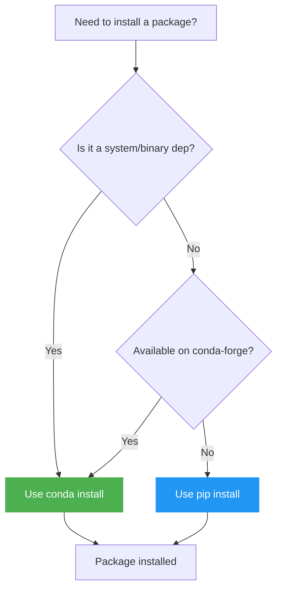

# Conda

Conda is a cross-platform **package and environment manager**. In this project it is used as an alternative to Docker, and it handles the installation of system-level packages (like PyTorch with CUDA, Open3D, and ROS 2 dependencies) that `pip` alone cannot reliably install.

---

## Why Conda?

Plain `pip` installs pure-Python packages well, but struggles with:

- **Binary compiled packages** that depend on specific system libraries (CUDA, MKL, cuDNN).
- **Non-Python dependencies** like system C libraries.
- **Reproducible cross-platform environments** — `environment.yml` captures the entire environment including non-Python tools.

Conda solves these by shipping pre-compiled binaries from curated channels.

---

## Conda vs. pip — When to Use Each



!!! note
    Once inside a conda environment you can freely mix `conda install` and `pip install`. Conda-installed packages take precedence for binary resolution.

---

## Installing Conda

=== "Miniconda (minimal)"

    ```bash
    # Download and run installer
    wget https://repo.anaconda.com/miniconda/Miniconda3-latest-Linux-x86_64.sh
    bash Miniconda3-latest-Linux-x86_64.sh -b -p $HOME/miniconda3

    # Add to your shell
    $HOME/miniconda3/bin/conda init bash   # or zsh / tcsh
    source ~/.bashrc

    # Verify
    conda --version
    ```

=== "Mamba (faster solver)"

    ```bash
    # Install miniforge (includes mamba by default)
    wget https://github.com/conda-forge/miniforge/releases/latest/download/Miniforge3-Linux-x86_64.sh
    bash Miniforge3-Linux-x86_64.sh -b
    source ~/miniforge3/etc/profile.d/conda.sh
    conda init

    # mamba is a drop-in faster replacement for conda
    mamba --version
    ```

---

## Core Concepts

| Term | Description |
|------|-------------|
| **environment** | An isolated directory of packages — like a separate Python installation |
| **channel** | A package repository (e.g. `defaults`, `conda-forge`, `pytorch`) |
| **`environment.yml`** | A declarative file listing all packages and channels to recreate an environment |
| **base** | The default conda environment — avoid installing project packages here |

---

## Essential Commands

### Environments

```bash
# Create from a YAML spec (recommended)
conda env create -f environment.yml

# Create manually
conda create -n myenv python=3.11

# Activate / deactivate
conda activate semantic_mapping
conda deactivate

# List all environments
conda env list

# Delete an environment
conda env remove -n myenv
```

### Packages

```bash
# Install from conda-forge
conda install -c conda-forge open3d

# Install from multiple channels
conda install -c pytorch -c nvidia pytorch torchvision pytorch-cuda=12.8

# Install with pip (inside activated env)
pip install groq openai

# List installed packages
conda list

# Export current environment to YAML
conda env export > environment.yml
```

### Updating

```bash
conda update conda
conda update --all           # Update all packages in current env
```

---

## Reading `environment.yml`

The project's `environment.yml` looks like this:

```yaml title="environment.yml"
name: semantic_mapping

channels:
  - pytorch          # PyTorch official packages (torch, torchvision)
  - pytorch3d        # 3D geometry ops
  - nvidia           # CUDA toolkit packages
  - conda-forge      # Community packages (large, up-to-date)
  - defaults

dependencies:
  - python=3.11
  - pytorch::pytorch=2.9.1
  - pytorch::torchvision=0.24.1
  - pytorch::pytorch-cuda=12.8
  - open3d=0.19.0
  - numpy=1.26.4
  - pip:             # These are installed with pip after conda packages
    - ultralytics==8.3.232
    - transformers==4.57.3
    - groq==0.36.0
```

The `channels` list defines priority order — packages are searched top-to-bottom. The `pytorch` channel is listed first to ensure the CUDA-enabled builds of PyTorch are picked up.

---

## Common Issues

!!! warning "Slow environment solve"
    Conda's default solver can be very slow with large dependency trees. Switch to `libmamba`:
    ```bash
    conda install -n base -c conda-forge conda-libmamba-solver
    conda config --set solver libmamba
    ```
    Or install [Mamba](https://mamba.readthedocs.io/) and replace `conda` with `mamba` in all commands.

!!! warning "Mixing conda and pip"
    Always run `conda install` before `pip install`. Adding packages via `pip` after conda can sometimes downgrade conda-managed binaries. In `environment.yml`, list pip packages under the `pip:` key to control install order.

!!! warning "`conda activate` not working"
    Run `conda init <your-shell>` (e.g. `conda init bash`) and restart your terminal. For `tcsh` users: `conda init tcsh`.

---

## Further Reading

- [Conda official documentation](https://docs.conda.io/projects/conda/en/stable/)
- [Conda cheatsheet (PDF)](https://docs.conda.io/projects/conda/en/latest/_downloads/843d9e0198f2a193a3484886fa28163c/conda-cheatsheet.pdf)
- [Mamba documentation](https://mamba.readthedocs.io/)
- [Managing environments — Conda docs](https://docs.conda.io/projects/conda/en/stable/user-guide/tasks/manage-environments.html)
