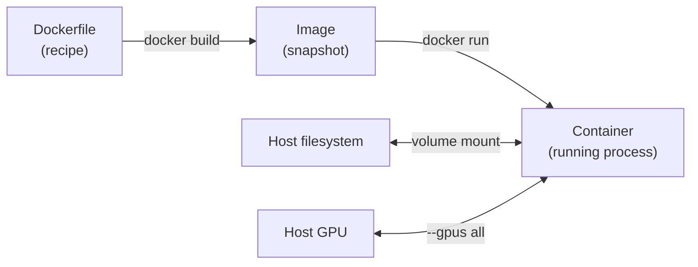

# Docker

Docker is the recommended way to run Spot Semantic Mapping. It packages the application and all its system-level dependencies — including the exact CUDA toolkit version — into a portable, reproducible **container**.

---

## Why Docker for This Project?

Setting up a GPU-accelerated Python environment manually is error-prone:

- PyTorch version must match the CUDA driver.
- Open3D, pytorch3d, and FAISS have specific binary compatibility requirements.
- System libraries (libcuda, cuDNN, cuBLAS) must match.

Docker solves all of this by shipping the exact environment that was tested.

---

## Core Concepts



| Concept | Analogy | Description |
|---------|---------|-------------|
| **Dockerfile** | Recipe | Instructions for building an image |
| **Image** | Snapshot / ISO | Immutable, shareable filesystem |
| **Container** | Running VM | A live instance of an image |
| **Volume** | Shared folder | Maps host directories into the container |
| **Registry** | App store | Hosts images (e.g. Docker Hub, GitHub Container Registry) |

---

## Installation

=== "Ubuntu / Debian"

    ```bash
    # Install Docker Engine (official script)
    curl -fsSL https://get.docker.com | sh

    # Add your user to the docker group (avoids needing sudo)
    sudo usermod -aG docker $USER
    newgrp docker   # apply without logging out

    # Verify
    docker run hello-world
    ```

=== "Windows / macOS"

    Download [Docker Desktop](https://www.docker.com/products/docker-desktop/). It includes the Docker Engine and Compose.

    !!! warning "GPU support on macOS"
        macOS does not support NVIDIA GPU passthrough inside Docker. Use the Conda installation path instead.

### NVIDIA Container Toolkit (GPU support)

```bash
# Add NVIDIA package repository
distribution=$(. /etc/os-release; echo $ID$VERSION_ID)
curl -s -L https://nvidia.github.io/nvidia-docker/gpgkey | sudo apt-key add -
curl -s -L https://nvidia.github.io/nvidia-docker/$distribution/nvidia-docker.list \
  | sudo tee /etc/apt/sources.list.d/nvidia-docker.list

sudo apt-get update && sudo apt-get install -y nvidia-container-toolkit
sudo systemctl restart docker

# Test GPU passthrough
docker run --rm --gpus all nvidia/cuda:12.8.0-base-ubuntu22.04 nvidia-smi
```

---

## Essential Commands

### Build & Run

```bash
# Build an image from a Dockerfile in the current directory
docker build -t my-image:latest .

# Run a container interactively with GPU and volume mount
docker run --rm -it \
    --gpus all \
    -v $(pwd):/workspace \
    my-image:latest bash
```

### Manage Containers

```bash
docker ps                    # List running containers
docker ps -a                 # List all containers (including stopped)
docker stop <container_id>   # Stop a running container
docker rm <container_id>     # Remove a stopped container
docker logs <container_id>   # View container logs
```

### Manage Images

```bash
docker images                # List local images
docker rmi <image_id>        # Delete an image
docker pull ubuntu:22.04     # Pull from Docker Hub
```

### Disk Cleanup

```bash
# Remove all stopped containers, dangling images, and unused networks
docker system prune

# Also remove unused volumes (careful — this deletes data!)
docker system prune --volumes
```

---

## How `activate_docker.sh` Works

The project's `activate_docker.sh` script wraps these Docker commands:

```bash
./activate_docker.sh         # Check for image → build if missing → start container
./activate_docker.sh --build # Force rebuild image
./activate_docker.sh --run   # Skip build check, start container immediately
```

Inside, it runs something equivalent to:

```bash
docker build -t spot-semantic-mapping .

docker run --rm -it \
    --gpus all \
    --shm-size=16g \               # Shared memory for PyTorch DataLoader workers
    -v $(pwd):/workspace \         # Mount repo into container
    -v $HOME/.cache:/root/.cache \ # Reuse HuggingFace model cache
    spot-semantic-mapping bash
```

---

## Dockerfile Anatomy

Our `Dockerfile` is structured as a multi-stage build:

```dockerfile title="Dockerfile (simplified)"
# Base: NVIDIA CUDA + cuDNN on Ubuntu 22.04
FROM nvidia/cuda:12.8.0-cudnn-devel-ubuntu22.04

# System dependencies
RUN apt-get update && apt-get install -y python3.11 python3-pip git libgl1

# Python dependencies
COPY requirements.txt requirement-torch.txt .
RUN pip install -r requirement-torch.txt
RUN pip install -r requirements.txt

# Install the project package
COPY . /workspace
WORKDIR /workspace
RUN pip install -e .
```

---

## Useful Tips

!!! tip "Persist model weights across rebuilds"
    Mount your model weights directory as a volume so you don't re-download on every image rebuild:
    ```bash
    -v /path/to/weights:/workspace/weights
    ```

!!! tip "Shared memory errors"
    If you see `RuntimeError: DataLoader worker ... ran out of shared memory`, increase `--shm-size`:
    ```bash
    docker run --shm-size=32g ...
    ```

!!! tip "Using VS Code inside a container"
    Install the [Dev Containers](https://marketplace.visualstudio.com/items?itemName=ms-vscode-remote.remote-containers) extension. The repo includes a `.devcontainer/` directory that configures this automatically.

---

## Further Reading

- [Docker Official Docs](https://docs.docker.com/)
- [Docker in 100 Seconds (YouTube)](https://www.youtube.com/watch?v=Gjnup-PuquQ)
- [NVIDIA Container Toolkit Docs](https://docs.nvidia.com/datacenter/cloud-native/container-toolkit/latest/index.html)
- [Best Practices for Dockerfiles](https://docs.docker.com/develop/develop-images/dockerfile_best-practices/)
