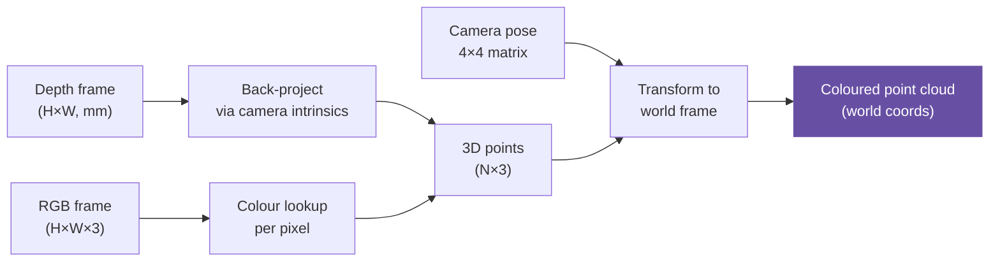

# Open3D

Open3D is an open-source library for 3D data processing. In Spot Semantic Mapping it is the backbone for all point cloud operations: constructing per-object 3D representations, computing overlap between objects, DBSCAN clustering, and visualisation.

---

## What is a Point Cloud?

A point cloud is a collection of 3D points sampled from the surface of objects in a scene. Each point stores at minimum its `(x, y, z)` coordinates; in this project points also store RGB colour and semantic labels.

```
Point cloud of a chair:
  (0.12, 1.43, 0.05, R=180, G=120, B=80)
  (0.11, 1.44, 0.08, R=178, G=119, B=82)
  ...  (thousands of points)
```

Point clouds come from **depth cameras** that measure the distance to each pixel — projecting depth + RGB into 3D gives a coloured point cloud.

---

## How Depth Maps Become Point Clouds



The projection formula for a point at pixel `(u, v)` with depth `d`:

```
x = (u - cx) * d / fx
y = (v - cy) * d / fy
z = d
```

where `(fx, fy, cx, cy)` are the camera **intrinsic parameters** (focal length and principal point).

---

## Core Open3D Concepts

### PointCloud Object

```python
import open3d as o3d
import numpy as np

# Create from raw arrays
pcd = o3d.geometry.PointCloud()
pcd.points = o3d.utility.Vector3dVector(np.random.rand(1000, 3))
pcd.colors = o3d.utility.Vector3dVector(np.random.rand(1000, 3))  # RGB [0,1]

# Load / save
pcd = o3d.io.read_point_cloud("semantics.ply")
o3d.io.write_point_cloud("output.ply", pcd)

# Visualise (opens a window)
o3d.visualization.draw_geometries([pcd])
```

### Voxel Downsampling

Large point clouds (millions of points) need to be subsampled for efficiency:

```python
# Average all points within each 5 cm voxel
pcd_down = pcd.voxel_down_sample(voxel_size=0.05)
```

### DBSCAN Clustering

DBSCAN groups spatially close points into clusters and marks outliers as noise — used in this project to separate individual object point clouds from background:

```python
# eps=0.1 m radius, min 10 points to form a cluster
labels = np.array(pcd.cluster_dbscan(eps=0.1, min_points=10))

# labels[i] = cluster index (-1 means noise)
max_label = labels.max()
print(f"Found {max_label + 1} clusters")

# Extract the largest cluster
largest = labels == np.bincount(labels[labels >= 0]).argmax()
pcd_object = pcd.select_by_index(np.where(largest)[0])
```

### Point Cloud IOU

This project uses point cloud overlap (Intersection over Union) as a geometric similarity metric for object tracking:

```python
def point_cloud_iou(pcd_a, pcd_b, voxel_size=0.05):
    # Voxelise both clouds
    vox_a = set(map(tuple, np.asarray(pcd_a.voxel_down_sample(voxel_size).points)))
    vox_b = set(map(tuple, np.asarray(pcd_b.voxel_down_sample(voxel_size).points)))
    intersection = len(vox_a & vox_b)
    union = len(vox_a | vox_b)
    return intersection / union if union > 0 else 0.0
```

### Coordinate Frame Transforms

Poses are represented as `4×4` homogeneous transformation matrices:

```python
# Apply a camera-to-world transform
pts = np.asarray(pcd.points)             # (N, 3)
pts_h = np.hstack([pts, np.ones((len(pts), 1))])   # homogeneous (N, 4)
pts_world = (T_world_cam @ pts_h.T).T[:, :3]       # transform and drop homogeneous
```

---

## Open3D in This Project

| Operation | Where used | Open3D API |
|-----------|-----------|-----------|
| Depth → 3D projection | `core/geometry.py` | `create_point_cloud_from_depth_image` |
| DBSCAN clustering | `core/geometry.py` | `cluster_dbscan` |
| Voxel downsampling | `mapping/tracker.py` | `voxel_down_sample` |
| IOU computation | `mapping/tracker.py` | Custom voxelised set ops |
| Top-down projection | `core/geometry.py` | `construct_top_down` |
| PLY export | `mapping/pipeline.py` | `write_point_cloud` |
| Interactive viz | `core/visualization.py` | `draw_geometries` |

---

## Installation

Open3D is included in the conda environment:

```bash
conda install -c conda-forge open3d=0.19.0
```

Or with pip:

```bash
pip install open3d==0.19.0
```

!!! warning "Headless servers"
    Open3D's visualiser requires a display. On a headless server use off-screen rendering:
    ```python
    import open3d as o3d
    o3d.visualization.rendering.OffscreenRenderer(800, 600)
    ```
    Or save the point cloud as a `.ply` and visualise locally.

---

## Further Reading

- [Open3D official documentation](http://www.open3d.org/docs/release/)
- [Open3D point cloud tutorial](http://www.open3d.org/docs/release/tutorial/geometry/pointcloud.html)
- [Open3D RGBD integration tutorial](http://www.open3d.org/docs/release/tutorial/reconstruction_system/index.html)
- [Understanding depth cameras (Intel RealSense blog)](https://www.intelrealsense.com/beginners-guide-to-depth/)
