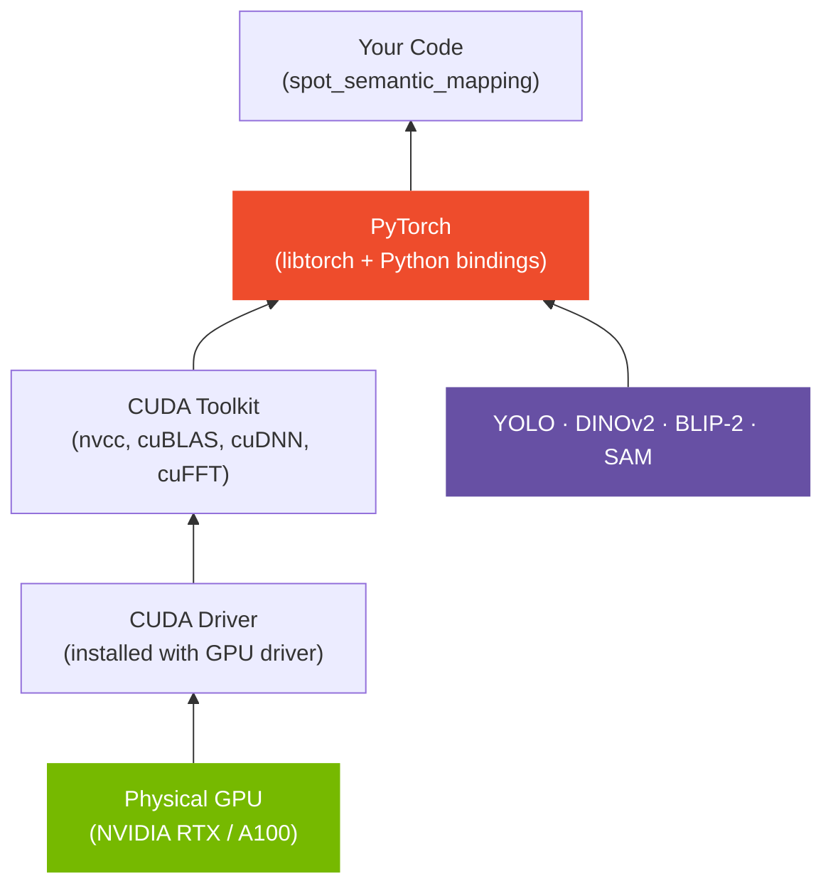

# PyTorch & CUDA

PyTorch is the deep learning framework that powers every neural network in this project — from YOLO object detection to DINOv2 feature extraction. CUDA is NVIDIA's parallel computing platform that makes running these models on a GPU fast enough to be practical.

---

## The Hardware → Software Stack



!!! important "Version alignment"
    PyTorch, CUDA Toolkit, and your GPU driver must be compatible. Check the [PyTorch compatibility matrix](https://pytorch.org/get-started/locally/) before installing. This project targets **PyTorch 2.9 + CUDA 12.8**.

---

## Core PyTorch Concepts

### Tensors

A tensor is PyTorch's fundamental data structure — essentially a multi-dimensional array that can live on CPU or GPU.

```python
import torch

# Create tensors
x = torch.tensor([1.0, 2.0, 3.0])          # 1-D, on CPU
x_gpu = x.to("cuda")                        # Move to GPU
img = torch.zeros(1, 3, 224, 224)           # Batch=1, C=3, H=224, W=224

# Common operations
out = torch.nn.functional.cosine_similarity(x, x_gpu.cpu())
```

In this project, tensors represent:

- **Image batches**: `(B, C, H, W)` — batch of RGB images
- **Depth maps**: `(H, W)` — single-channel depth
- **Feature vectors**: `(N, D)` — N embeddings of dimension D
- **Point clouds**: `(N, 3)` — N points in 3D space

### Moving Data Between CPU and GPU

```python
device = torch.device("cuda" if torch.cuda.is_available() else "cpu")

model = model.to(device)       # Move model weights to GPU
tensor = tensor.to(device)     # Move tensor to GPU

# Always move back to CPU before converting to numpy
arr = tensor.cpu().numpy()
```

### The `no_grad` Context

During inference (not training), you don't need gradients. Disabling them saves memory and speeds up computation:

```python
with torch.no_grad():
    features = model(image_tensor)
```

All inference in this project uses `torch.no_grad()` or `torch.inference_mode()`.

---

## GPU Memory Management

GPU memory is a finite resource. Large models and batches can exhaust it.

```python
# Check available memory
print(torch.cuda.memory_allocated() / 1e9, "GB in use")
print(torch.cuda.memory_reserved() / 1e9, "GB reserved")

# Free cached allocations (after deleting tensors)
torch.cuda.empty_cache()
```

### Common OOM (Out-of-Memory) Fixes

| Problem | Fix |
|---------|-----|
| Batch too large | Reduce `batch_size` in config |
| Accumulating tensors | Delete intermediate tensors, use `del x` |
| Multiple models loaded | Move unused models to CPU or unload |
| Fragmented memory | Call `torch.cuda.empty_cache()` |

!!! tip "Monitor GPU memory in real time"
    ```bash
    watch -n 0.5 nvidia-smi
    ```
    The project also has a utility:
    ```python
    from spot_semantic_mapping.core.logger import log_gpu_memory
    log_gpu_memory()
    ```

---

## Models Used in This Project

| Model | Framework | Purpose |
|-------|-----------|---------|
| **YOLOv8/v11** | Ultralytics (PyTorch) | Open-set object detection |
| **SAM 2.1** | PyTorch | Instance segmentation masks |
| **DINOv2** (ViT-L/14) | HuggingFace Transformers | Patch-level visual features for VPR |
| **SigLIP** | HuggingFace Transformers | Image-text similarity scoring |
| **BLIP-2** | HuggingFace Transformers | Multi-view image captioning |

All models are loaded in half-precision (`float16`) by default to reduce VRAM usage.

---

## HuggingFace Transformers

DINOv2, SigLIP, and BLIP-2 are loaded via the `transformers` library:

```python
from transformers import AutoModel, AutoProcessor

model = AutoModel.from_pretrained(
    "facebook/dinov2-large",
    torch_dtype=torch.float16,
).to("cuda")

processor = AutoProcessor.from_pretrained("facebook/dinov2-large")
```

Models are downloaded on first use and cached in `~/.cache/huggingface/`. Subsequent loads are instant.

---

## CUDA Verification

```python
import torch

print("CUDA available:", torch.cuda.is_available())
print("CUDA version:  ", torch.version.cuda)
print("GPU count:     ", torch.cuda.device_count())
print("GPU name:      ", torch.cuda.get_device_name(0))

# Quick sanity test
x = torch.ones(1000, 1000, device="cuda")
y = x @ x.T
print("Matrix multiply on GPU: OK")
```

Or run the provided script:

```bash
python scripts/check_cuda.py
```

---

## Further Reading

- [PyTorch — Learning the Basics](https://pytorch.org/tutorials/beginner/basics/intro.html)
- [PyTorch Tensors tutorial](https://pytorch.org/tutorials/beginner/blitz/tensor_tutorial.html)
- [Understanding CUDA memory management](https://pytorch.org/docs/stable/notes/cuda.html)
- [HuggingFace Transformers — Quick Tour](https://huggingface.co/docs/transformers/quicktour)
- [fast.ai Practical Deep Learning (free course)](https://course.fast.ai/)
