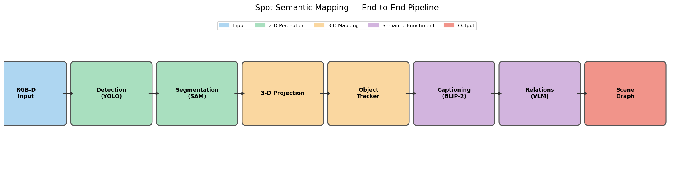
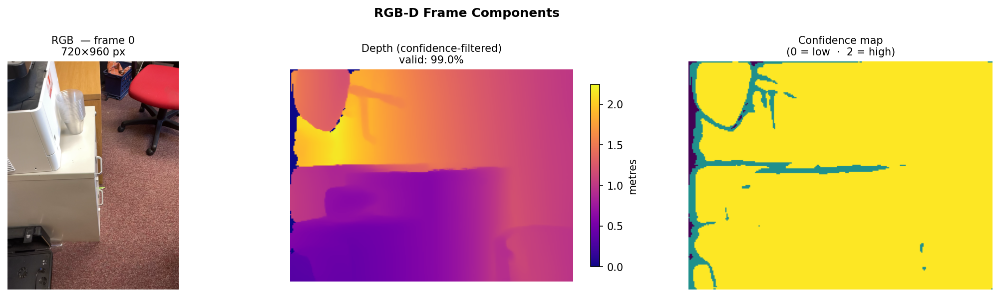
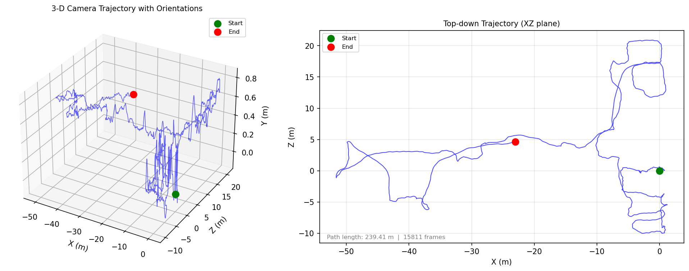

# Tutorial 1 · Data Loading

> **Notebook:** `notebooks/01_data_loading.ipynb`

This notebook introduces the project configuration system and shows how to load RGB-D recordings from both Spot and iPhone sensors.

---

## What You'll Learn

- How to load and inspect `main_config.yml`
- How camera intrinsics and extrinsics are represented
- How to iterate frames from a recording
- How to visualise RGB-D data and camera trajectories

---

## Pipeline Overview



---

## Key Concepts

### Camera Intrinsics

The intrinsic matrix `K` encodes the camera's optical properties:

```
K = [[fx,  0, cx],
     [ 0, fy, cy],
     [ 0,  0,  1]]
```

| Parameter | Meaning |
|-----------|---------|
| `fx, fy` | Focal length in pixels |
| `cx, cy` | Principal point (image centre) |

### Camera Extrinsics (Poses)

Each frame has a `4×4` transformation matrix `T_world_cam` that places the camera in the world coordinate frame:

```
T = [[R | t],    R = 3×3 rotation
     [0 | 1]]    t = 3×1 translation
```

### Dataset Directory Layout

=== "iPhone"

    ```
    my_scene/
    ├── color/           000000.jpg  000001.jpg  ...
    ├── depth/           000000.png  000001.png  ...  (16-bit, mm)
    ├── confidence/      000000.png  000001.png  ...
    ├── camera_matrix.csv
    └── odometry.csv     # timestamp, tx, ty, tz, qx, qy, qz, qw
    ```

=== "Spot"

    ```
    my_scene/
    ├── 1234567890/      # Unix timestamp (nanoseconds)
    │   ├── frontleft_fisheye_image.jpg
    │   ├── frontleft_depth_in_visual_frame.png
    │   ├── ...          (one file per camera)
    │   └── poses.pkl
    ├── 1234567891/
    └── ...
    ```

---

## Code Walkthrough

### Load Config

```python
from spot_semantic_mapping.configs.loader import cfg

print("Device:", cfg["device"])
print("Depth resolution:", cfg["depth_width"], "×", cfg["depth_height"])
```

### Load an iPhone Recording

```python
from spot_semantic_mapping.core.io import (
    load_intrinsics, load_poses, load_depth
)
from pathlib import Path
import cv2

dataset_path = Path("data/iphone/my_scene")

K = load_intrinsics(dataset_path / "camera_matrix.csv")
poses = load_poses(dataset_path / "odometry.csv")

# Load a single frame
frame_id = 42
rgb   = cv2.imread(str(dataset_path / "color" / f"{frame_id:06d}.jpg"))
depth = load_depth(dataset_path / "depth" / f"{frame_id:06d}.png")

print(f"RGB shape: {rgb.shape}")         # (H, W, 3)
print(f"Depth shape: {depth.shape}")     # (H, W)  in metres
print(f"Depth range: {depth.min():.2f} – {depth.max():.2f} m")
```

### Iterate All Frames

```python
from spot_semantic_mapping.core.dataloader import RGBDDataset
from torch.utils.data import DataLoader

dataset = RGBDDataset(dataset_path, cfg=cfg)
loader  = DataLoader(dataset, batch_size=1, shuffle=False)

for batch in loader:
    rgb, depth, confidence, intrinsics, pose = batch
    # rgb:   (1, H, W, 3)
    # depth: (1, H, W)
    # pose:  (1, 4, 4)
    break
```

### RGB-D Frame

The three components of a single iPhone frame — RGB image, depth map (in metres, confidence-filtered), and the confidence map:



### Visualise Trajectory

The trajectory extracted from `odometry.csv` — 3D view on the left, top-down XZ projection on the right:



```python
import numpy as np
import matplotlib.pyplot as plt

positions = np.array([p[:3, 3] for p in poses])  # extract (x, y, z) from each pose

fig, axes = plt.subplots(1, 2, figsize=(12, 5))

# Top-down (XY) view
axes[0].plot(positions[:, 0], positions[:, 1], "-o", markersize=2)
axes[0].set_xlabel("x (m)"); axes[0].set_ylabel("y (m)")
axes[0].set_title("Top-down trajectory"); axes[0].set_aspect("equal")

# Side (XZ) view
axes[1].plot(positions[:, 0], positions[:, 2], "-o", markersize=2)
axes[1].set_xlabel("x (m)"); axes[1].set_ylabel("z (m)")
axes[1].set_title("Side view"); axes[1].set_aspect("equal")

plt.tight_layout()
plt.show()
```

---

## What's Next

Continue to [Tutorial 2: Detection & Segmentation →](detection_segmentation.md)
