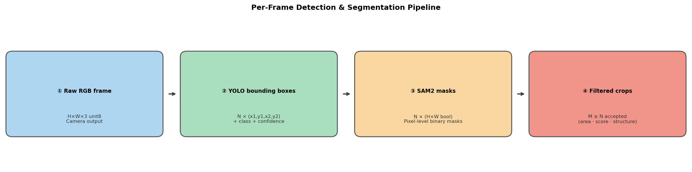
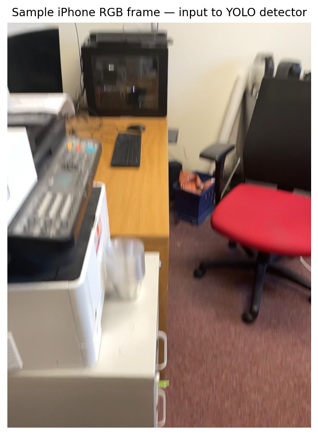
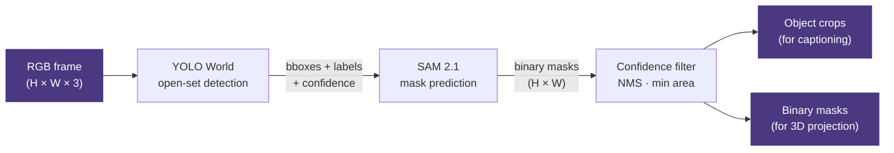

# Tutorial 2 · Detection & Segmentation

> **Notebook:** `notebooks/02_detection_segmentation.ipynb`

This notebook runs YOLO open-world detection and SAM 2.1 segmentation on RGB frames, producing per-object binary masks ready for 3D projection.

---

## What You'll Learn

- How to configure and run `YOLODetector` with custom class lists
- How to refine bounding boxes with SAM 2.1
- How to filter detections by confidence and mask quality
- How to visualise detection results

---

## Pipeline Overview

Each RGB frame passes through four steps before any 3D work begins:



Below is a raw iPhone frame as fed to the detector:





---

## Code Walkthrough

### Initialise Models

```python
from spot_semantic_mapping.models.detection import YOLODetector
from spot_semantic_mapping.models.segmentation import SAM2Predictor
from spot_semantic_mapping.configs.loader import cfg

detector  = YOLODetector(cfg["yolo_checkpoint"], device=cfg["device"])
segmentor = SAM2Predictor(
    cfg["sam2_checkpoint"],
    cfg["sam2_config"],
    device=cfg["device"],
)
```

### Run Detection

```python
import cv2

rgb_bgr = cv2.imread("data/iphone/my_scene/color/000042.jpg")

# Returns list of (bbox_xyxy, confidence, label)
detections = detector.detect(
    rgb_bgr,
    classes=cfg["classes"],
    conf_threshold=cfg["detection_conf"],
)

print(f"Found {len(detections)} detections")
for bbox, conf, label in detections:
    x1, y1, x2, y2 = bbox
    print(f"  {label:20s}  conf={conf:.2f}  bbox=[{x1},{y1},{x2},{y2}]")
```

### Refine with SAM 2.1

```python
masks = segmentor.predict(
    image=rgb_bgr,
    boxes=[d[0] for d in detections],  # pass all bboxes at once
)

# masks: list of (H, W) boolean arrays
for i, mask in enumerate(masks):
    label = detections[i][2]
    coverage = mask.sum() / (mask.shape[0] * mask.shape[1]) * 100
    print(f"  {label}: {mask.sum()} pixels ({coverage:.1f}% of frame)")
```

### Visualise Results

```python
import numpy as np
import matplotlib.pyplot as plt
import matplotlib.patches as patches

fig, (ax1, ax2) = plt.subplots(1, 2, figsize=(14, 6))

rgb_rgb = cv2.cvtColor(rgb_bgr, cv2.COLOR_BGR2RGB)

# Left: YOLO bboxes
ax1.imshow(rgb_rgb)
for (x1, y1, x2, y2), conf, label in detections:
    rect = patches.Rectangle((x1, y1), x2 - x1, y2 - y1,
                               linewidth=2, edgecolor='lime', facecolor='none')
    ax1.add_patch(rect)
    ax1.text(x1, y1 - 4, f"{label} {conf:.2f}",
             color='lime', fontsize=8, fontweight='bold')
ax1.set_title("YOLO detections"); ax1.axis('off')

# Right: SAM masks overlay
overlay = rgb_rgb.copy()
colors = plt.cm.tab20(np.linspace(0, 1, len(masks)))[:, :3]
for mask, color in zip(masks, colors):
    overlay[mask] = (overlay[mask] * 0.4 + color * 255 * 0.6).astype(np.uint8)
ax2.imshow(overlay)
ax2.set_title("SAM 2.1 masks"); ax2.axis('off')

plt.tight_layout(); plt.show()
```

### Filtering

```python
from spot_semantic_mapping.mapping.pipeline import run_yolo_sam

# The pipeline convenience function combines detection + segmentation + filtering
results = run_yolo_sam(
    rgb_frame=rgb_bgr,
    depth_frame=depth,
    detector=detector,
    segmentor=segmentor,
    cfg=cfg,
)

# results: list of Detection objects ready for 3D projection
print(f"{len(results)} valid detections after filtering")
```

---

## Choosing a SAM Backend

| Backend | Speed | Accuracy | VRAM |
|---------|-------|---------|------|
| **SAM 2.1** (default) | Slow | Best | ~6 GB |
| **MobileSAM** | Fast | Good | ~1 GB |
| **FastSAM** | Very fast | Lower | ~1 GB |

Switch backend in `main_config.yml`:

```yaml
sam_backend: mobilesam   # "sam2" | "mobilesam" | "fastsam"
```

---

## What's Next

Continue to [Tutorial 3: Scene Graph Construction →](scene_graph.md)
