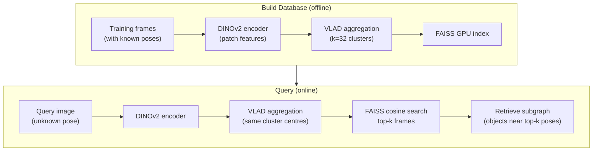
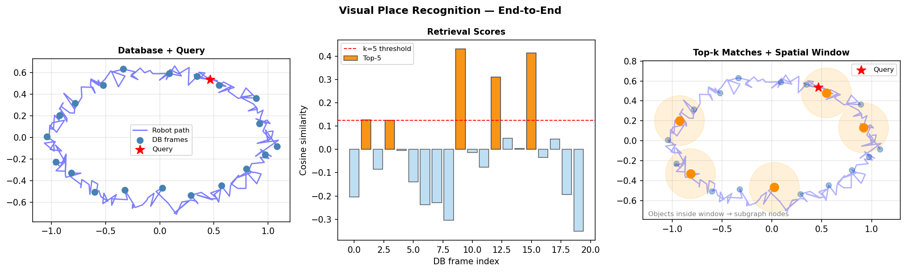
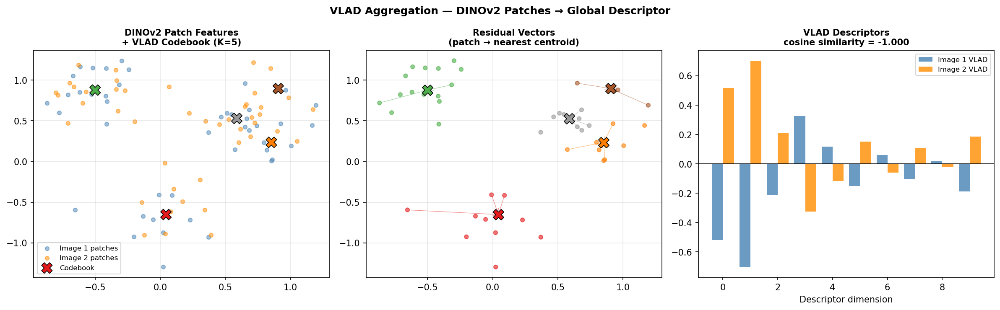
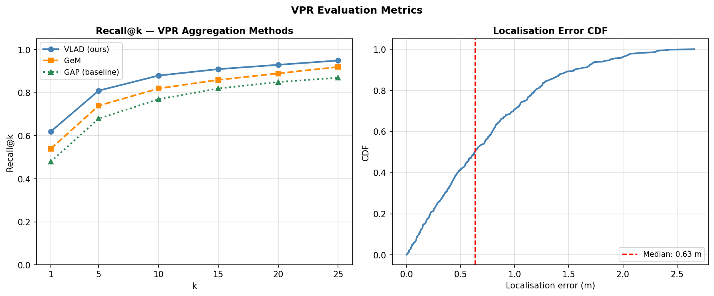

# Tutorial 4 · Localization (VPR)

> **Notebook:** `notebooks/04_localization_vpr.ipynb`

This notebook builds a Visual Place Recognition database from training frames and localises query images within the constructed scene graph.

---

## What You'll Learn

- How to encode training frames with DINOv2 + VLAD
- How to build a FAISS search index
- How to localise a query image and retrieve a subgraph
- How to evaluate Recall@k and median localisation error

---

## Pipeline Overview



---

## VPR Illustrated

The three phases of VPR — database construction, cosine retrieval, and spatial window filtering:



DINOv2 patch features are aggregated into a compact VLAD descriptor. The left panel shows raw patch features + codebook, the centre shows residual assignment, the right compares two VLAD descriptors:



---

## Code Walkthrough

### Build the Database

```python
from spot_semantic_mapping.localization.dataset import build_database
from spot_semantic_mapping.configs.loader import cfg

# Encodes all training frames and saves descriptor + pose for each
db = build_database(
    dataset_path="data/iphone/my_scene",
    cfg=cfg,
    split="train",   # or a list of frame IDs
)

print(f"Database size: {len(db)} frames")
print(f"Descriptor dim: {db.descriptors.shape[1]}")   # e.g. 32768
```

### Localise a Single Query

```python
from spot_semantic_mapping.localization.localizer import localize
from spot_semantic_mapping.mapping.io import load_scene_graph
import cv2

graph = load_scene_graph("outputs/my_scene/scene_graph.json")

query_img = cv2.imread("data/iphone/my_scene/color/000200.jpg")

results = localize(
    query_image=query_img,
    database=db,
    scene_graph=graph,
    top_k=5,
    window_radius=2.0,   # subgraph radius in metres
    cfg=cfg,
)

for r in results:
    print(f"Frame {r.frame_id:5d}  score={r.score:.4f}  "
          f"pos=({r.pose[0,3]:.2f}, {r.pose[1,3]:.2f}, {r.pose[2,3]:.2f})")
```

### Retrieve the Subgraph

```python
from spot_semantic_mapping.localization.localizer import retrieve_subgraphs

subgraph = retrieve_subgraphs(
    frame_ids=[r.frame_id for r in results],
    scene_graph=graph,
    window_radius=2.0,
)

print(f"Subgraph contains {len(subgraph.nodes)} objects:")
for node in subgraph.nodes:
    print(f"  [{node.id}] {node.label}: {node.caption[:60]}")
```

### Visualise Top Match

```python
import matplotlib.pyplot as plt
import cv2

best = results[0]
best_frame = cv2.cvtColor(
    cv2.imread(f"data/iphone/my_scene/color/{best.frame_id:06d}.jpg"),
    cv2.COLOR_BGR2RGB
)
query_rgb = cv2.cvtColor(query_img, cv2.COLOR_BGR2RGB)

fig, (ax1, ax2) = plt.subplots(1, 2, figsize=(12, 5))
ax1.imshow(query_rgb);   ax1.set_title("Query image");       ax1.axis('off')
ax2.imshow(best_frame);  ax2.set_title(f"Best match (frame {best.frame_id}, score={best.score:.3f})");  ax2.axis('off')
plt.tight_layout();  plt.show()
```

---

## Evaluation

To evaluate on a full test set with ground-truth poses:

```python
from spot_semantic_mapping.localization.evaluation import compute_metrics_from_scores
from spot_semantic_mapping.localization.dataset import build_database
import numpy as np

# Build separate train and test databases
db_train = build_database("data/iphone/my_scene", cfg=cfg, split="train")
db_test  = build_database("data/iphone/my_scene", cfg=cfg, split="test")

# Compute similarity matrix (test × train)
from spot_semantic_mapping.core.jax_helper import cosine_similarity_jax
scores = cosine_similarity_jax(db_test.descriptors, db_train.descriptors)

# Evaluate
metrics = compute_metrics_from_scores(
    scores=scores,
    db_train_poses=db_train.poses,
    db_test_poses=db_test.poses,
    ks=[1, 5, 10],
    distance_thresholds=[0.25, 0.5, 1.0],
)

print("Recall@1  @0.25m:", metrics["recall@1@0.25"])
print("Recall@5  @1.0m: ", metrics["recall@5@1.0"])
print("Median error:    ", metrics["median_error"], "m")
```

---

## Evaluation Results

Recall@k and localisation error CDF — VLAD consistently outperforms GeM and GAP baselines:



## Aggregation Method Comparison

Try different VPR aggregation methods by changing `vpr_aggregation` in `main_config.yml`:

```python
results_by_method = {}

for method in ["vlad", "domain_vlad", "gem", "gap"]:
    cfg["vpr_aggregation"] = method
    db = build_database("data/iphone/my_scene", cfg=cfg)
    scores = cosine_similarity_jax(db_test.descriptors, db.descriptors)
    metrics = compute_metrics_from_scores(scores, ...)
    results_by_method[method] = metrics["recall@1@0.25"]
    print(f"{method:15s}  R@1@0.25={metrics['recall@1@0.25']:.3f}")
```

---

## Congratulations!

You've completed all four tutorials. You can now:

- Load and inspect RGB-D recordings from Spot and iPhone
- Run open-world detection and segmentation
- Build 3D scene graphs with tracked, captioned objects and spatial relations
- Localise query images against a VPR database

Explore the [API Reference](../api/index.md) to understand every module in depth, or jump into the [Concepts](../concepts/architecture.md) section for deeper theory.
