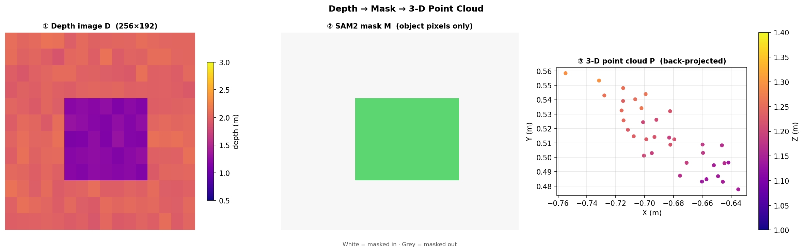
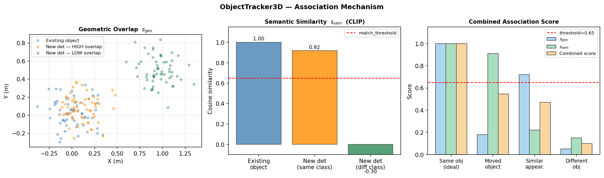
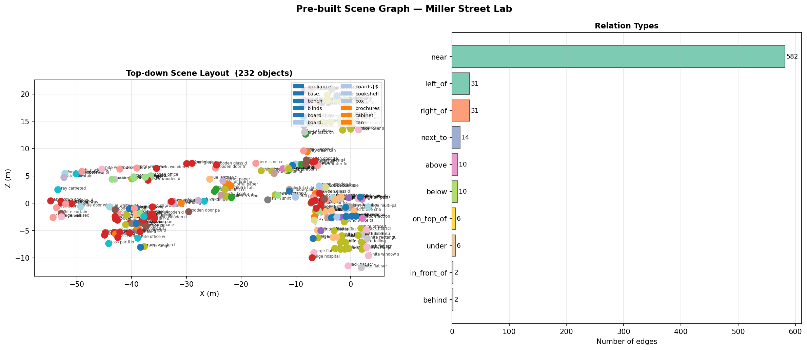

# Tutorial 3 · Scene Graph Construction

> **Notebook:** `notebooks/03_scene_graph_construction.ipynb`

This notebook runs the complete scene graph construction pipeline: 3D projection, multi-frame tracking, BLIP-2 captioning, spatial relation extraction, and export.

---

## What You'll Learn

- How to project 2D masks to 3D point clouds using depth + camera pose
- How `ObjectTracker3D` associates detections across frames
- How BLIP-2 captions each tracked object using multi-view crops
- How spatial relations are extracted via VLM voting
- How to export and inspect the final scene graph

---

## Running the Full Pipeline

The simplest way to build a scene graph is the CLI or `main()` function:

```python
from spot_semantic_mapping.mapping.pipeline import main
from spot_semantic_mapping.configs.loader import cfg

tracker = main(
    dataset_path="data/iphone/my_scene",
    output_dir="outputs/my_scene",
    rotate=-90,      # rotate depth frames (common for handheld iPhone recordings)
    floor_only=False,
    cfg=cfg,
)

print(f"Tracked {len(tracker.objects)} objects")
```

The rest of this tutorial dissects each stage.

---

## Stage 1 · 3D Projection

The three-step process from depth image to masked point cloud:




```python
from spot_semantic_mapping.core.geometry import back_project_depth
import numpy as np

# Back-project depth pixels within a mask to 3D world points
def project_detection_to_3d(mask, depth, K, T_world_cam):
    ys, xs = np.where(mask)
    z = depth[ys, xs]

    # Intrinsic back-projection
    x_3d = (xs - K[0, 2]) * z / K[0, 0]
    y_3d = (ys - K[1, 2]) * z / K[1, 1]
    points_cam = np.stack([x_3d, y_3d, z], axis=-1)   # (N, 3)

    # Camera → World transform
    pts_h = np.hstack([points_cam, np.ones((len(points_cam), 1))])
    pts_world = (T_world_cam @ pts_h.T).T[:, :3]

    # Discard invalid depth
    valid = (z > 0.1) & (z < cfg["max_depth"])
    return pts_world[valid]
```

---

## Stage 2 · Multi-Frame Tracking

`ObjectTracker3D` scores each new detection against every existing object using geometric overlap ($s_{geo}$) and CLIP visual similarity ($s_{sem}$). The combined score must exceed `match_threshold` to associate:




```python
from spot_semantic_mapping.mapping.tracker import ObjectTracker3D

tracker = ObjectTracker3D(cfg=cfg)

for frame_id, (rgb, depth, conf, K, pose) in enumerate(loader):
    detections = run_yolo_sam(rgb, depth, detector, segmentor, cfg)

    for det in detections:
        # Project to 3D
        det.point_cloud = project_detection_to_3d(det.mask, depth, K, pose)

        # SigLIP embedding of the crop
        det.embedding = siglip_model.embed_image(det.crop)

    tracker.update(detections, frame_id=frame_id)

print(f"After tracking: {len(tracker.objects)} unique objects")
```

### Visualise Tracked Objects

```python
import open3d as o3d

# Assign a unique colour per object
colours = plt.cm.tab20(np.linspace(0, 1, len(tracker.objects)))[:, :3]
pcds = []

for obj, colour in zip(tracker.objects, colours):
    pcd = o3d.geometry.PointCloud()
    pcd.points = o3d.utility.Vector3dVector(obj.point_cloud)
    pcd.paint_uniform_color(colour)
    pcds.append(pcd)

o3d.visualization.draw_geometries(pcds)
```

---

## Stage 3 · Multi-View Captioning

```python
from spot_semantic_mapping.models.captioning import BlipCaptioner
from spot_semantic_mapping.core.crops import concat_crops_horizontal

captioner = BlipCaptioner(cfg["blip2_model"], device=cfg["device"])

for obj in tracker.objects:
    # Concatenate up to 5 crops horizontally
    mosaic = concat_crops_horizontal(obj.crops[:5])
    obj.caption = captioner.caption(mosaic)
    print(f"[{obj.id}] {obj.label}: "{obj.caption}"")
```

---

## Stage 4 · Spatial Relation Extraction

```python
from spot_semantic_mapping.mapping.relations import build_sparse_scene_graph_edges

edges = build_sparse_scene_graph_edges(
    objects=tracker.objects,
    knn=cfg["relation_knn"],
    votes_required=cfg["relation_votes"],
    llm_provider=cfg["relation_llm"],
    cfg=cfg,
)

for edge in edges[:10]:
    src = tracker.objects[edge.source_id]
    tgt = tracker.objects[edge.target_id]
    print(f"{src.label} --[{edge.relation}]--> {tgt.label}  (conf={edge.confidence:.2f})")
```

---

## Stage 5 · Export

```python
from spot_semantic_mapping.core.types import export_scene_graph
from spot_semantic_mapping.core.logger import save_full_tracker
import json

# Export JSON + coloured PLY
export_scene_graph(
    tracker=tracker,
    edges=edges,
    output_dir="outputs/my_scene",
)

# Also save the full tracker checkpoint for later
save_full_tracker(tracker, "outputs/my_scene/tracker.pkl")

print("Exported:")
print("  outputs/my_scene/scene_graph.json")
print("  outputs/my_scene/semantics.ply")
print("  outputs/my_scene/tracker.pkl")
```

---

## Pre-built Scene Graph

The graph built from the Miller Street lab dataset — top-down spatial layout on the left, relation type breakdown on the right:



## Inspect the Output

```python
from spot_semantic_mapping.mapping.io import load_scene_graph

graph = load_scene_graph("outputs/my_scene/scene_graph.json")

print(f"Nodes: {len(graph.nodes)}")
print(f"Edges: {len(graph.edges)}")

for node in sorted(graph.nodes, key=lambda n: -n.num_views)[:5]:
    print(f"  [{node.id:3d}] {node.label:20s}  views={node.num_views}  {node.caption[:60]}")
```

---

## What's Next

Continue to [Tutorial 4: Localization (VPR) →](localization.md)
